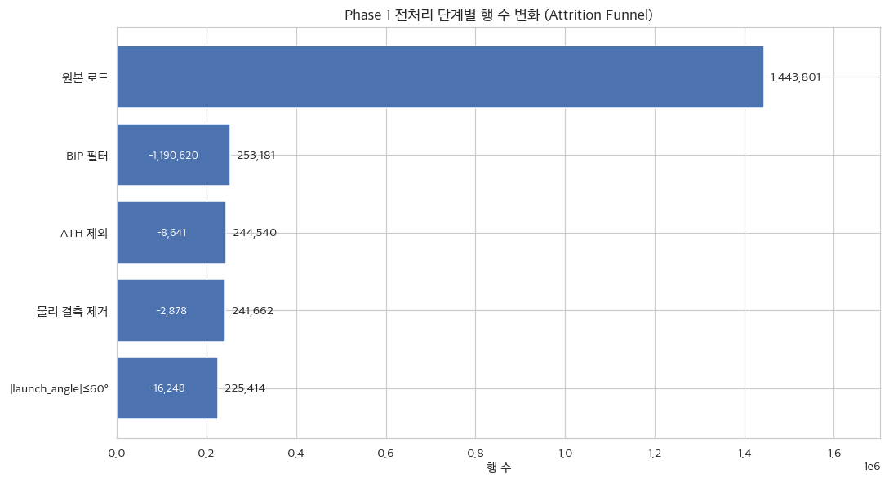
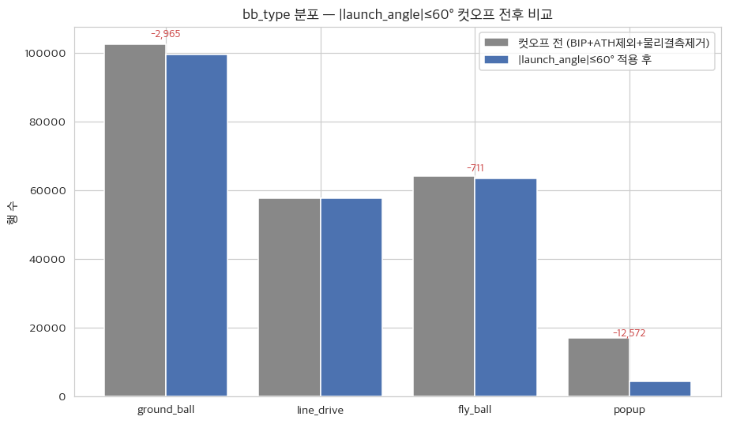
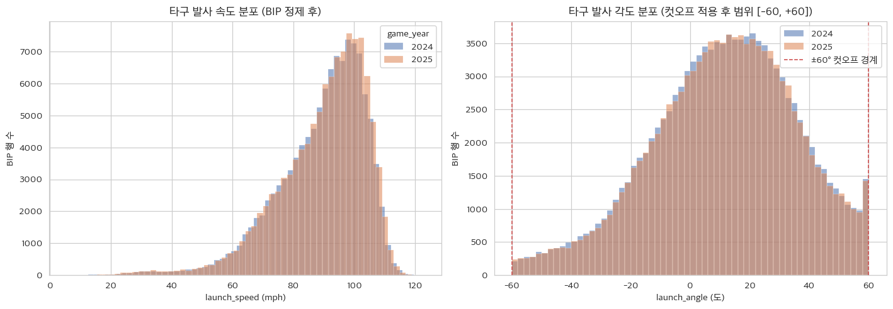
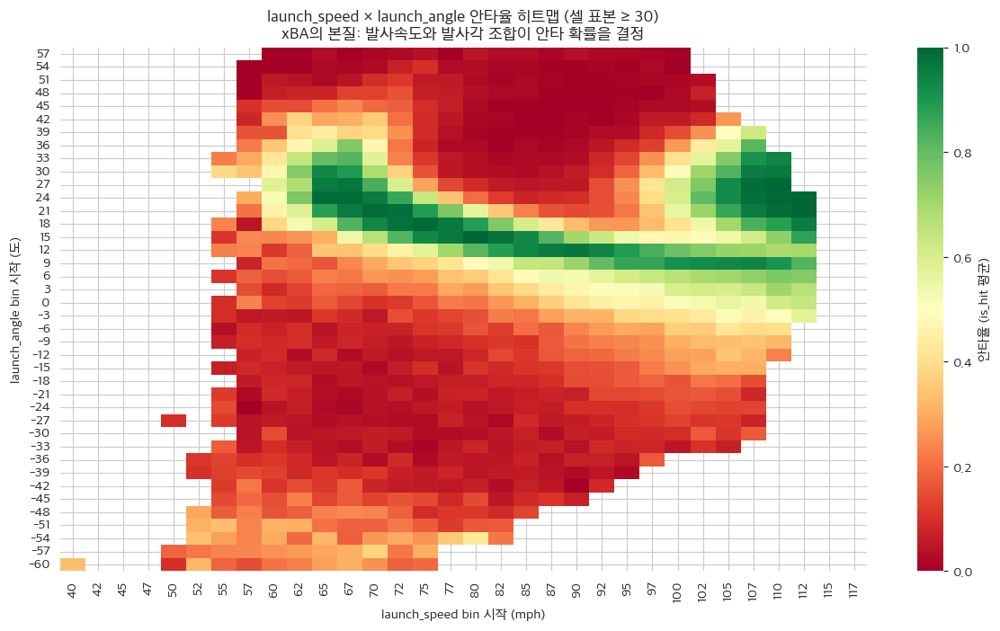
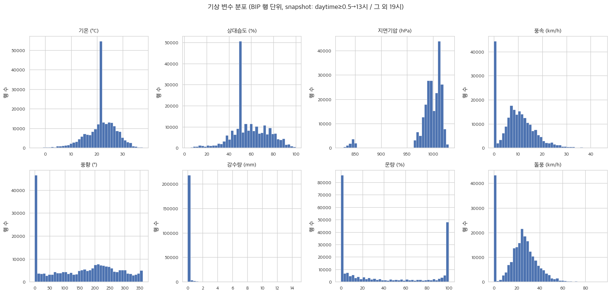
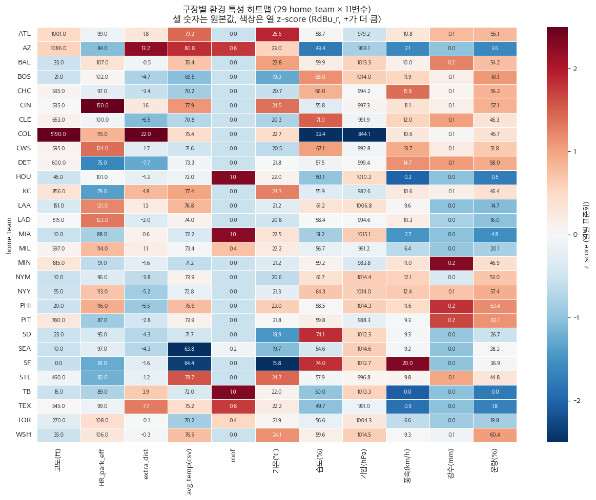

# Phase 1 Report — 데이터 통합, 도메인 기반 전처리 및 연도별 분리

_생성: 2026-05-29 13:28_  
_실행 스크립트: `pipeline/step1_phase1_preprocessing.py`_

## 1. 서론 요약
본 단계는 MLB Statcast 타구 데이터(2024~2025), 구장 스펙 데이터, Open-Meteo Historical 기상 데이터를 결합하여 후속 모델링의 입력 데이터셋을 구성한다. 모든 처리는 도메인 지식과 사용자 승인 결정에 따라 수행되며, 데이터 누수(Data Leakage)를 차단하기 위해 game_year 기준으로 엄격한 Temporal Split(2024 ↔ 2025)을 실시한다.

## 2. 데이터 셋 설명
- Statcast: `데이터셋/statcast_bat_tracking_2024_2025.csv` (원본 1,443,801행 × 118열, pitch 단위)
- 구장 스펙: `데이터셋/ballparks.csv` (30개 구장 × 15열, lat/lon 컬럼은 Phase 1에서 보강)
- 기상: Open-Meteo Archive API `archive-api.open-meteo.com/v1/archive` (무료, 키 불요)
- Target 변수 `is_hit`: events ∈ {single, double, triple, home_run} → 1, 그 외 → 0 (MLB 공식 xBA와 정렬)
- 최종 전처리 후 안타율 = 0.3411

## 3. 결정 사항(분기점 기록)
사용자 컨펌으로 확정된 분석 결정.

| # | 결정 항목 | 채택안 | 사유 / 영향 |
|---|---|---|---|
| 1 | BIP(인플레이 타구) 정의 | `bb_type ∈ {ground_ball, fly_ball, line_drive, popup}` (옵션 C) | 가장 보수적 정의 — 타구 추적이 확실한 행만 사용. 안타율 계산 분모가 깨끗함. |
| 2 | Target `is_hit` 정의 | `events ∈ {single, double, triple, home_run}` → 1 (옵션 A) | MLB 공식 xBA 정의와 동일. Phase 5의 ca-xBA vs xBA 비교 일관성 확보. sac_fly/field_error 등은 0. |
| 3 | 핵심 물리 결측(launch_speed/angle NaN) 처리 | 행 제거 (옵션 A) | xBA는 launch_speed×launch_angle 함수 — 결측 시 모델 입력 불가. 전체 BIP의 1.2% (약 3K행) 손실은 미미. |
| 4 | `|launch_angle| > 60°` 컷오프 | 채택 (옵션 A) | readme 예시 그대로. 파울 팝아웃·극단 음각 라인드라이브를 노이즈로 제거. popup의 평균 la=65.8°, 안타율 1.4%로 대부분 제거됨. |
| 5 | launch_speed 하한 컷오프 | 컷오프 없음 (옵션 A) | 약타도 실제 BIP의 일부이며 xBA 정의에 포함. 인위적 절단은 정보 손실. |
| 6 | 배트 트래킹 변수 결측 처리 | NaN 유지 + `*_is_missing` 플래그 추가 (옵션 B) | 2024 11.46% / 2025 5.21% 결측은 시즌 초반 비공개 구간 때문. 트리 모델 NaN-native 처리 활용, 결측 패턴 자체를 신호로 보존. |
| 7 | Athletics(ATH) 매핑 | 2024+2025 ATH 홈경기 전체 분석 제외 (옵션 D) | 2025년 홈구장이 Oakland Coliseum → Sutter Health Park(새크라멘토)로 이전 — 환경 변수가 완전히 달라 단일 매핑 불가. 8,641행(BIP의 3.4%) 손실 감수. |
| 8 | 구장 위·경도 추가 방식 | ballparks.csv 자체에 lat/lon 컬럼 추가 (옵션 B) | 데이터셋 자체 완성도. 공개 좌표(MLB 공식/Wikipedia) 하드코딩 입력. |
| 9 | 기상 API 시점 처리 | `daytime ≥ 0.5` → 13:00 / 그 외 → 19:00 현지시각 snapshot (옵션 D) | first-pitch 시각 부재. ballparks.csv의 daytime 비율로 구장별 분기. 낮경기·야간경기 평균 시점 근사. |
| 10 | 기상 변수 셋 | 8종(temperature, humidity, surface_pressure, wind_speed, wind_direction, precipitation, cloud_cover, wind_gusts) (옵션 C) | 공기 밀도(온·습·압) + 바람(속·향·돌풍) + 경기 영향(강수·운량) 모두 커버. 다중공선성은 Phase 2에서 정리. |
| 11 | 돔/지붕 닫힘 경기 기상 마스킹 | **MLB Stats API 경기별 `weather.condition` 기반 정밀 마스킹** — closed 경기에서 외부 5종(wind_speed/gusts/direction · precipitation · cloud_cover) = 0, 실내 2종(temperature_2m=22°C · relative_humidity_2m=50%) = 공조 표준값, surface_pressure 그대로 | 도메인 사실 "돔에서는 외부 기상이 안타 확률에 영향을 줄 수 없다" 를 학습 데이터에 *직접* 반영. 단순 roof 컬럼(0~1 시즌 평균)만으로는 트리 모델이 *조건부 무력화 split* 을 학습하지 못함을 사후 검증. 공기 밀도(기온·습·압) 보존 + 외부 직접 기상 무력화 분리 적용. |

## 4. 단계별 attrition (행 수 변화)
원본 1,443,801행은 5단계 정제를 거쳐 최종 225,414개의 BIP로 압축된다. 단계별 행 수 변화는 그림 1(Attrition Funnel)에 시각화되어 있으며, BIP 필터 단계에서 전체의 약 82.5%(타격 외 pitch 행)가, 도메인 컷오프(|launch_angle| > 60°)에서 추가로 16,248행이 제거되는 것이 가장 큰 두 단일 컷이다.

## 5. BIP 필터 직후 bb_type 분포
```
bb_type
NaN            1190620
ground_ball     107795
fly_ball         67226
line_drive       60271
popup            17889
Name: count, dtype: int64
```

## 6. 배트 트래킹 결측률 (전처리 직전 BIP 기준, 연도별)
|                                          |   2024 |   2025 |
|:-----------------------------------------|-------:|-------:|
| bat_speed                                | 0.1135 | 0.0522 |
| swing_length                             | 0.1135 | 0.0522 |
| attack_angle                             | 0.1135 | 0.0522 |
| attack_direction                         | 0.1135 | 0.0522 |
| swing_path_tilt                          | 0.1135 | 0.0522 |
| intercept_ball_minus_batter_pos_x_inches | 0.1135 | 0.0527 |
| intercept_ball_minus_batter_pos_y_inches | 0.1135 | 0.0527 |

## 7b. 돔/지붕 닫힘 경기 기상 마스킹 (결정 #11)

- MLB Stats API (`/api/v1.1/game/{game_pk}/feed/live` 의 `gameData.weather.condition`)에서 "Roof Closed" 또는 "Dome" 으로 명시된 경기에 한해 기상 변수 마스킹 적용.
- 캐시 파일: `pipeline/cache/mlb_roof_status_cache.json` (1,318 게임, 누락 0건).
- 마스킹된 BIP 행: **43,197** / 대상 가능(retractable + TB) **61,677** (70.0%)
- 적용 값:
  - 외부 기상 5종 → 0: `wx_wind_speed_10m`, `wx_wind_gusts_10m`, `wx_wind_direction_10m`, `wx_precipitation`, `wx_cloud_cover`
  - 실내 공조 표준값 2종: `wx_temperature_2m` = 22°C (MLB 돔 표준), `wx_relative_humidity_2m` = 50% (ASHRAE 권장 중간값)
  - 변경 없음: `wx_surface_pressure` (실내·외 기압 동일)
- 도메인 의의: 트리 앙상블 모델이 *roof × 기상 상호작용* 을 자동 학습할 수 있도록, 학습 데이터에 "돔 경기에서는 기상 변수가 상수" 라는 사실을 직접 주입.

## 7. 기상 데이터 병합 결과
- 호출 구장 수: 30 (Athletics 제외)
- 호출 변수: temperature_2m, relative_humidity_2m, surface_pressure, wind_speed_10m, wind_direction_10m, precipitation, cloud_cover, wind_gusts_10m (총 8종)
- 시점: daytime≥0.5 → 13:00 현지시각 / 그 외 → 19:00 현지시각
- 캐시: `pipeline/cache/weather_{team}_{start}_{end}.json`
- 기상 결측 행: 0 / 225,414 (0.00%)

### 기상 변수 요약 통계
|                         |   count |   mean |    std |   min |   25% |    50% |    75% |    max |
|:------------------------|--------:|-------:|-------:|------:|------:|-------:|-------:|-------:|
| wx_temperature_2m       |  225414 |  21.82 |   5.61 |  -4.1 |  19.3 |   22   |   25.4 |   37.8 |
| wx_relative_humidity_2m |  225414 |  58.31 |  16.25 |   3   |  50   |   55   |   70   |  100   |
| wx_surface_pressure     |  225414 | 994.82 |  32.85 | 822.5 | 989.4 | 1000.4 | 1012.5 | 1030.4 |
| wx_wind_speed_10m       |  225414 |   9.43 |   6.97 |   0   |   4.6 |    9.1 |   13.7 |   44.6 |
| wx_wind_direction_10m   |  225414 | 153.13 | 113.49 |   0   |  34   |  165   |  245   |  360   |
| wx_precipitation        |  225414 |   0.07 |   0.54 |   0   |   0   |    0   |    0   |   14.5 |
| wx_cloud_cover          |  225414 |  38.02 |  42.05 |   0   |   0   |   15   |   93   |  100   |
| wx_wind_gusts_10m       |  225414 |  22.37 |  14.38 |   0   |  13.7 |   24.1 |   31.3 |   94.3 |

## 8. Temporal Split 결과
| 연도 | 행 수 | 안타율 | 타자 수 | 투수 수 | 구장 수 | 기간 | 저장 경로 |
|---:|---:|---:|---:|---:|---:|---|---|
| 2024 | 113,409 | 0.3411 | 884 | 956 | 29 | 2024-03-20~2024-09-29 | `pipeline/output/2024_data.parquet` |
| 2025 | 112,005 | 0.3411 | 664 | 869 | 29 | 2025-03-27~2025-09-28 | `pipeline/output/2025_data.parquet` |

- 2024_data 는 Phase 2~4 학습/평가용, 2025_data 는 Phase 5 검증 정답지용으로 격리.

## 9. 산출물 파일 목록
- `pipeline/output/2024_data.parquet`
- `pipeline/output/2025_data.parquet`
- `pipeline/cache/weather_<team>_<start>_<end>.json` (구장별 Open-Meteo raw 응답 캐시)

## 10. 시각화

아래 PNG는 모두 `pipeline/figures/` 에 저장되어 있으며, 최종 Word 보고서로 옮길 때 그대로 재사용 가능하다.

### 10.1 전처리 흐름

**(A1) 단계별 행 수 변화 — Attrition Funnel**



- 원본 1,443,801행 중 BIP 필터 단계에서 **약 82.5%**가 제거됨(타격 외 pitch 단위 행).
- 도메인 컷오프는 |launch_angle|≤60°가 가장 큰 단일 컷(−16,248행).

**(A2) bb_type 분포 — 컷오프 전후**



- popup이 컷오프로 거의 전량 제거됨 → 평균 launch_angle=65.8°, 안타율 1.4%의 사실상 자동 아웃 군집 제거.
- ground_ball / line_drive / fly_ball 의 페어 영역은 보존.

### 10.2 타구 물리 분포

**(B1) 발사속도/발사각 히스토그램 (연도별 overlay)**



- 2024와 2025의 분포가 거의 동일 — Temporal Split 후에도 입력 변수의 분포가 안정적임을 시각적으로 확인.
- launch_angle은 컷오프 적용으로 [−60, +60] 범위에 갇혀있음(붉은 점선 = 컷오프 경계).

**(B2) launch_speed × launch_angle 안타율 히트맵**



- xBA의 본질 시각화: 발사속도가 빠르고 각도가 약 10~25°일 때 안타율이 가장 높음(녹색 띠).
- 위 띠 위(40°+, 낮은 EV)는 팝업 영역, 아래 띠(음각·낮은 EV)는 그라운드 아웃 영역으로 안타율이 급락.
- 환경 변수(바람·기압·온도 등)는 이 *비선형 의존성* 위에 추가 보정을 제공할 것이 Phase 3 가설.

이 히트맵은 본 연구가 트리 앙상블 알고리즘을 채택한 수학적 근거이기도 하다. 그림 4에서 나타나듯, 발사속도와 발사각이 안타율에 미치는 영향은 이미 그 자체로 강한 비선형성 — 특정 각도와 속도의 교집합에서만 안타율이 급증하는 좁은 띠 형태 — 을 띤다. 여기에 온도·풍속·구장 고도 등 60여 개의 환경 변수가 추가로 얽힐 경우, 변수 간의 독립성과 단조 증가를 가정하는 선형 모델(Logistic Regression)은 이 복잡한 교호작용을 결코 담아낼 수 없다. 즉 두 물리 변수만으로도 이미 선형 가정이 깨지는 구조이므로, 환경 맥락까지 포착하려면 입력 공간을 조건부로 분할하는 비선형 모델이 필연적으로 요구된다(Phase 3에서 통계적으로 검정).

### 10.3 환경 변수

**(C1) 기상 변수 8종 분포 grid**



- 기온은 약 23°C에 중심한 정규-유사 분포, 풍속/풍향은 우측 꼬리·균등 분포.
- 강수는 강한 영(0) 집중 — 변수 변환(예: log1p) 또는 이진화가 Phase 2에서 검토될 수 있음.

**(C2) 구장별 환경 특성 히트맵 (29 home_team × 11 변수)**



- COL(쿠어스): 고도 5,190ft / 평균기온 정상 / 풍속 정상 — *고도 단일 변수*로 분리되는 극단 구장.
- MIA·TB·HOU·TEX·AZ·TOR·MIL: roof로 환경 영향이 일부/전면 차단(셀 색이 다른 환경 변수에서 두드러짐).
- 환경 변수들이 구장 간에 의미 있는 분산을 가지며 — ca-xBA가 추출하려는 *환경 신호*의 원천이 확인됨.
