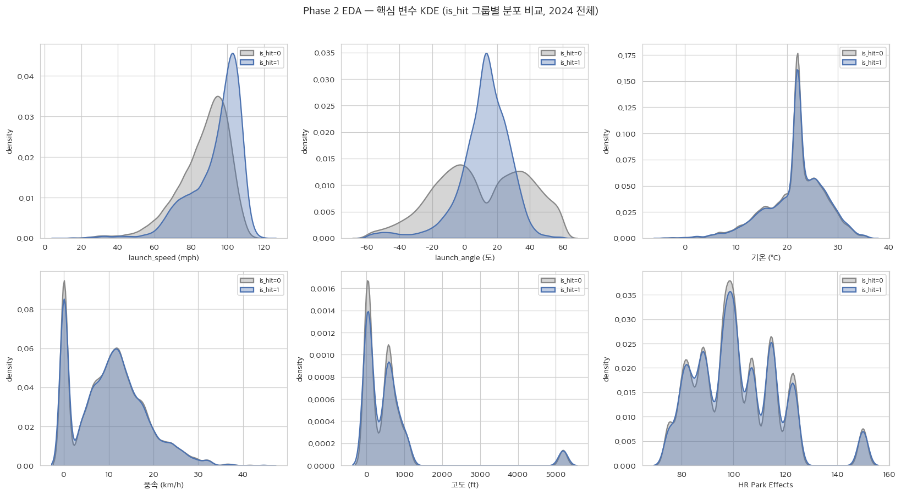
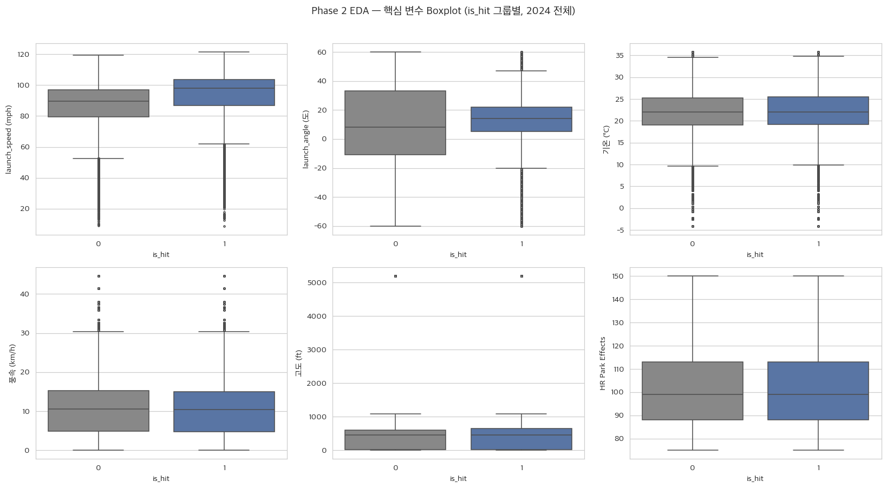
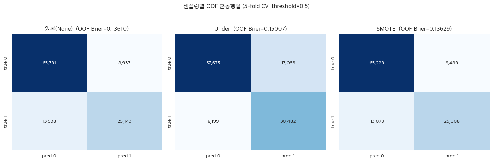
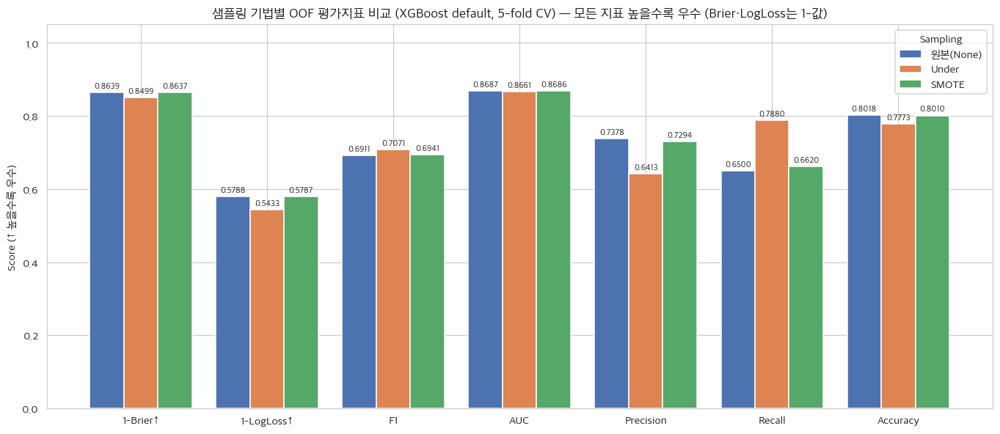
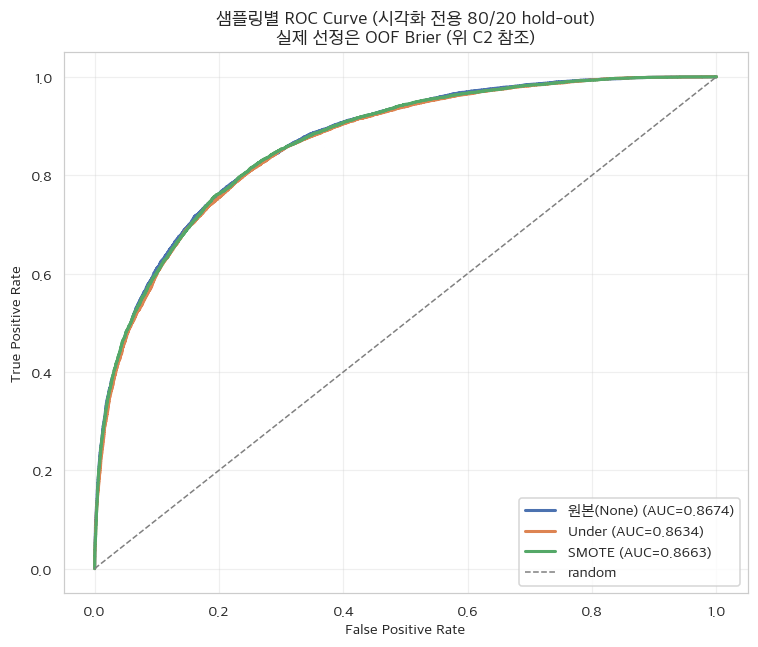
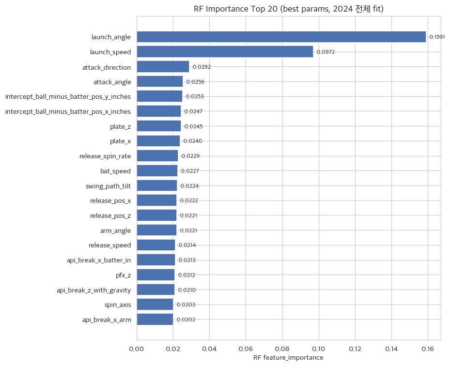
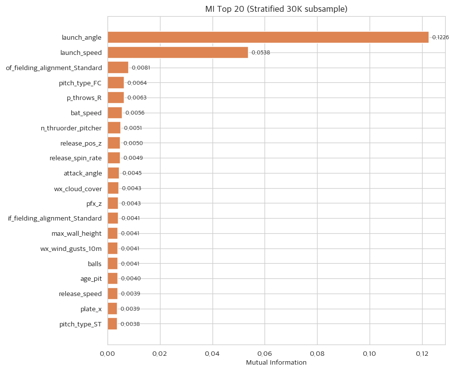
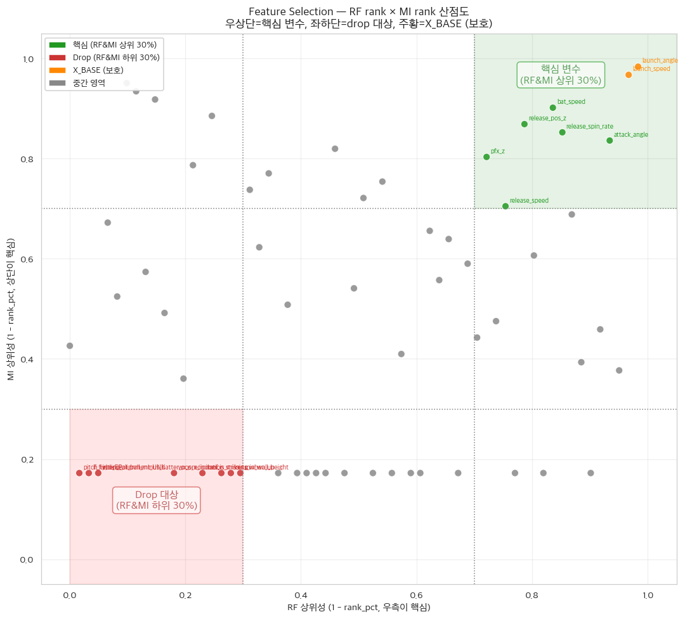

# Phase 2 Report — 상관관계 분석, 스케일링, 최적 샘플링, Feature Selection

_생성: 2026-05-29 14:47_  
_실행 스크립트: `pipeline/step2_phase2_correlation_sampling.py`_

> 본 단계는 **2024_data.parquet 만** 사용한다. 2025_data는 Phase 5까지 격리되어 어떤 통계도 누설되지 않는다.

## 1. 결정 사항 (사용자 컨펌, Phase 1 dome-masking 이후 분기 전수 재확인)

| # | 결정 항목 | 채택안 | 사유 |
|---|---|---|---|
| 1 | X_base 정의 | `launch_speed`, `launch_angle` (2종) | MLB 공식 xBA와 동일 입력으로 통제군 명료화. |
| 2 | 카테고리형 인코딩 | One-Hot (stand/p_throws=L/R binary, pitch_type·alignment=dummy) | 카테고리 적어 차원 폭발 없음. |
| 3 | Train/Test 분할 | **2025는 검증 전용 격리** / 2024 안에서 **StratifiedKFold 5-fold CV (train+val 통합)** | data leakage 0. CV가 hold-out test 대체. |
| 4 | X_advanced 초기 변수 풀 | 광범위 정의(투구·PA·구장·기상 모두) | FS·공선성 단계에서 정리하도록 설계. |
| 5 | 다중공선성 임계값 | **|r| > 0.95** (Pearson) | 거의 동일한 변수만 제거하는 보수적 기준. |
| 6 | 다중공선성 drop 규칙 | X_BASE 보존 → **derived 변수 우선 drop** → variance fallback | 도메인 의미 우선(소스 > 파생). derived: `effective_speed`, `api_break_*`, `wx_wind_gusts_10m`, `max_wall_height`. |
| 7 | 처리 순서 | impute → scale → corr_drop → sampling → FS | scale 후 corr 안정성 + variance fallback 적용 위해. |
| 8 | Robust Scaler | numeric만(unique>2) | 이상치 강건. LogReg(Phase 3 통제군) 호환. |
| 9 | NaN imputation (numeric) | **2024 전체 median fill** | CV 격자에 같은 imputation. *_is_missing 플래그는 신호 보존. |
| 10 | NaN 카테고리 처리 | NaN → 'UNK' 더미 | 결측 패턴을 카테고리로 보존. |
| 11 | 상호작용 FE | **Raw 그대로** (트리에 맡김) | dome-masking이 dome-day 시그널을 충분히 전달. 명시적 product feature 추가 없음. |
| 12 | 샘플링 비교 | None / RandomUnderSampler / SMOTE 3종 **모두** | 결과 비교 후 선택. 사전 가정 배제. |
| 13 | 샘플링 평가 모델 | XGBoost **default** + StratifiedKFold 5-fold CV | 모델 가설 중립. baseline default 공정 비교. |
| 14 | 샘플링 선정 메트릭 | **Brier Score (OOF predict_proba)** 최솟값 | ca-xBA는 확률 값의 정상도가 핵심. F1·AUC는 보조 표시. |
| 15 | EDA 범위 | Pearson 상관, \|r\|>0.95 중복 제거, RF importance, MI | 다관점 신호 종합. |
| 16 | FS 계산용 모델 | RF (RandomizedSearchCV 튜닝된 best_estimator) — split impurity 기반 `feature_importances_` | 이전 step2 검증된 방식 복원. 3-model Permutation Importance 는 macOS joblib memmap 디스크 한계로 미채택. |
| 17 | FS 제거 규칙 | **2개 기준(RF importance & MI) 모두 하위 30% 동시 진입** 시 drop (X_BASE 제외) | 보수적 — 한 지표라도 중요하면 보존. |
| 18 | RF 하이퍼파라미터 (FS용) | RandomizedSearchCV: search space `{'n_estimators': [100, 200, 500], 'max_depth': [10, 20, None], 'min_samples_split': [2, 4, 6], 'criterion': ['gini', 'entropy']}` / n_iter=20, cv=3, scoring=neg_brier_score | importance 수치 신뢰성 확보. |
| 19 | MI subsample | Stratified 30,000행 (is_hit 비율 유지), seed=42 | 통계 안정성+연산 효율. |
| 20 | M2 발열 관리 | 단계 간 `time.sleep(20s)`, `n_jobs=2` | 노트북 thermal throttling 완화. |

## 2. 변수 그룹 정의 및 초기 풀 구성

| 그룹 | 변수 수 | 내용 |
|---|---:|---|
| (a) xBA 핵심 | 2 | launch_speed, launch_angle |
| (b) 배트 트래킹 + 결측플래그 | 14 | 7 numeric + 7 *_is_missing |
| (c) 타석 정체성 (binary) | 2 | stand_R, p_throws_R |
| (d) 투구 물리 (numeric) | 15 | release_speed, pfx_*, plate_*, spin, break, arm_angle 등 |
| (d2) pitch_type one-hot | (가변) | pitch_type_* 더미 변수 |
| (e) PA 상황 (numeric) | 8 | balls/strikes/outs/inning/age/order 등 |
| (e2) alignment one-hot | (가변) | if/of_fielding_alignment 더미 |
| (f) 구장 정적 | 10 | 펜스거리·높이·hr_park_effects·extra_distance·고도·roof·daytime |
| (g) 기상 동적 (dome-masked) | 8 | 온도·습도·기압·풍속·풍향·강수·운량·돌풍 — closed roof일 시 외부 5종=0, 실내 기온 22°C/습도 50% 대체 (Phase 1 §7b) |
| **X_advanced 초기(One-Hot 후)** | **82** | |

## 3. NaN 처리 (전체 2024 median 기반 imputation)

총 13개 numeric 컬럼의 결측치는 **2024 전체 중앙값(median)**으로 대체하여 데이터 누수를 방지했다. 동시에 각 변수의 `*_is_missing` 플래그를 추가해 결측 패턴 자체를 모델 입력 신호로 보존한다(세부 대체 값은 부록 B 참조).

## 4. Cross-Validation 구조 (5-fold StratifiedKFold)

- 2024 전체 113,409행 → StratifiedKFold(n_splits=5, shuffle=True, random_state=42)
- 안타율(전체): 0.3411
- **2025는 Phase 5 외부 검증 전용** — 본 단계에서 어떤 통계도 사용하지 않음

## 5. 다중공선성 분석 (|r| > 0.95, Pearson)

다중공선성 문제 해결을 위해 Pearson 상관계수($r > 0.95$)를 기준으로 고상관 쌍 **24건**을 식별했으며, X_BASE 보존 → derived 변수 우선 drop → 분산 보존 규칙(variance fallback)의 순서로 총 **9개** 변수를 제거했다. 제거 대상은 대부분 동일한 결측 패턴을 공유하는 `*_is_missing` 플래그 군과 derived 변수(`effective_speed`, `wx_surface_pressure` 등)이다(상위 고상관 변수 쌍 전체 목록은 부록 A 참조).

**제거된 변수 전체 목록:** `attack_angle_is_missing`, `attack_direction_is_missing`, `bat_speed_is_missing`, `effective_speed`, `intercept_ball_minus_batter_pos_y_inches_is_missing`, `of_fielding_alignment_UNK`, `swing_length_is_missing`, `swing_path_tilt_is_missing`, `wx_surface_pressure`

## 6. Robust Scaler

- 스케일 적용 컬럼: **50**개 (이진 0/1 변수는 제외)
- 2024 전체 fit, transform → `pipeline/output/phase2_scaler.joblib`

## 7. 샘플링 비교 (3종 × XGBoost default × 5-fold CV)

**OOF (Out-Of-Fold) predict_proba 기반 메트릭:**

| 샘플링 | Train mean 0/1 | **OOF Brier** | OOF LogLoss | OOF F1 | OOF AUC | OOF P/R | fold Brier mean±SD |
|---|---:|---:|---:|---:|---:|---:|---:|
| **None** | 59,782/30,944 | **0.13610** | 0.42122 | 0.6911 | 0.8687 | 0.7378/0.6500 | 0.13610±0.00076 |
| **Under** | 30,944/30,944 | **0.15007** | 0.45671 | 0.7071 | 0.8661 | 0.6413/0.7880 | 0.15007±0.00126 |
| **SMOTE** | 59,782/59,782 | **0.13629** | 0.42132 | 0.6941 | 0.8686 | 0.7294/0.6620 | 0.13629±0.00098 |

- **최종 선정 샘플링: `None`** (OOF Brier 기준 최소)
- 선정 사유: OOF predict_proba 의 Brier(=평균 (y-p)²) 가 가장 낮은 기법. 확률 정상도 우선.

## 8. Feature Selection (RF importance + MI)

- 학습 데이터: 최적 샘플링(`None`) 적용 X
- **RF Tuning**: `RandomizedSearchCV(n_iter=20, cv=3, scoring='neg_brier_score', n_jobs=2)`
  - search space: `{'n_estimators': [100, 200, 500], 'max_depth': [10, 20, None], 'min_samples_split': [2, 4, 6], 'criterion': ['gini', 'entropy']}`
  - **best params**: `{'n_estimators': 200, 'min_samples_split': 4, 'max_depth': None, 'criterion': 'entropy'}`
  - **best CV neg_brier_score (3-fold avg)**: -0.16062 (Brier = 0.16062)
- **Mutual Information**: stratified 30,000행 subsample, seed=42
- 제거 규칙: **RF importance & MI 둘 다 하위 30% 동시 진입** 시 drop (X_BASE 제외)
- 비고: 당초 3-model Permutation Importance 안이 채택되었으나, macOS joblib memmap 디스크 한계(RF default fit-된 모델의 worker 직렬화 시 OSError 28)로 인해 검증된 이전 step2 방식(RF RandomizedSearchCV → `feature_importances_` + MI)으로 복원.

RF importance와 MI 두 지표의 Top 20 변수는 각각 그림 12(RF Importance Top 20)와 그림 13(MI Top 20)의 막대그래프로 제시한다. 두 지표 모두에서 `launch_angle`과 `launch_speed`가 압도적 상위를 차지하여 xBA의 물리적 본질과 일치하며, 그 아래로 배트 트래킹·투구 물리·구장·기상 변수가 완만하게 분포한다.

### 8.3 Feature Selection으로 제거된 변수 (12개)

`if_fielding_alignment_Strategic`, `pitch_type_CH`, `pitch_type_CS`, `pitch_type_CU`, `pitch_type_FA`, `pitch_type_FF`, `pitch_type_FO`, `pitch_type_FS`, `pitch_type_KC`, `pitch_type_KN`, `pitch_type_SI`, `pitch_type_SV`

## 9. 최종 X_advanced 변수 확정

- X_BASE: **2개** — Phase 3 통제군용
- X_advanced 초기: **82개**
- 다중공선성 drop: **9개**
- Feature Selection drop: **12개**
- **X_advanced 최종: 61개**

**X_advanced 최종 변수 목록:**

`launch_speed`, `launch_angle`, `bat_speed`, `swing_length`, `attack_angle`, `attack_direction`, `swing_path_tilt`, `intercept_ball_minus_batter_pos_x_inches`, `intercept_ball_minus_batter_pos_y_inches`, `intercept_ball_minus_batter_pos_x_inches_is_missing`, `release_speed`, `release_pos_x`, `release_pos_z`, `pfx_x`, `pfx_z`, `plate_x`, `plate_z`, `release_spin_rate`, `release_extension`, `spin_axis`, `api_break_z_with_gravity`, `api_break_x_arm`, `api_break_x_batter_in`, `arm_angle`, `balls`, `strikes`, `outs_when_up`, `inning`, `age_pit`, `age_bat`, `n_thruorder_pitcher`, `n_priorpa_thisgame_player_at_bat`, `left_field`, `center_field`, `right_field`, `min_wall_height`, `max_wall_height`, `hr_park_effects`, `extra_distance`, `elevation`, `roof`, `daytime`, `wx_temperature_2m`, `wx_relative_humidity_2m`, `wx_wind_speed_10m`, `wx_wind_direction_10m`, `wx_precipitation`, `wx_cloud_cover`, `wx_wind_gusts_10m`, `stand_R`, `p_throws_R`, `pitch_type_EP`, `pitch_type_FC`, `pitch_type_SC`, `pitch_type_SL`, `pitch_type_ST`, `if_fielding_alignment_Infield shade`, `if_fielding_alignment_Standard`, `if_fielding_alignment_UNK`, `of_fielding_alignment_Standard`, `of_fielding_alignment_Strategic`

## 9. 시각화

PNG 파일은 모두 `pipeline/figures/`에 저장. 최종 Word 보고서 작성 시 그대로 재사용 가능.
> _(B) 상관관계 히트맵은 변수 80+개 가독성 문제로 제외. 다중공선성 제거 변수 쌍은 §5 마크다운 표 참조._

### 9.1 EDA — 핵심 변수 분포 (is_hit 그룹별, 2024 전체)

**(A1) KDE — 연속 분포 비교**

- launch_speed: is_hit=1 그룹의 분포가 우측(고속)으로 이동 → 발사 속도가 빠를수록 안타 확률 ↑.
- launch_angle: is_hit=1 그룹이 10~25° 부근에 집중 → 라인드라이브 각도가 가장 유리.
- 환경 변수(기온·풍속·고도·HR park effects): is_hit 그룹 간 분포 차이가 미미 → 단변량만으로는 신호 약함. **다른 변수와의 비선형 상호작용(트리 모델)이 필요함을 시사**.

**(A2) Boxplot — 중앙값/IQR/이상치 비교**

- KDE 결과와 동일한 패턴이 quartile 통계로 재확인됨.
- launch_speed 의 IQR이 is_hit=1 에서 명확히 우측으로 이동.

### 9.2 샘플링 기법 비교 (5-fold CV OOF — XGBoost default)

**(C1) OOF 혼동행렬 (3개 샘플링, threshold=0.5)**

- 5-fold CV OOF predict_proba 기반 — Phase 2 step2 산출값과 일치.
- 원본(None): True Negative 다수, Recall 낮음 (보수적 예측).
- Under: TP 대폭 증가, 동시에 FP도 증가 → Recall ↑ / Precision ↓ 트레이드오프.
- SMOTE: 원본에 가까운 균형, F1은 원본보다 살짝 ↑.

**(C2) OOF 평가지표 막대 비교 (Brier↓ / LogLoss↓ / F1 / AUC / P / R / Acc)**

- **최종 선정 = `None`** (OOF Brier 기준 최솟값: 0.13610).
- Brier·LogLoss는 낮을수록 우수 — 확률 정상도(probability calibration) 기준.
- F1만 보면 Under가 가장 높지만, 확률값 자체가 깨져서 ca-xBA 산출에 부적합.

**(C3) ROC Curve 겹치기 (시각화 전용 80/20 hold-out)**

- 본 ROC 는 시각화 목적으로 단일 80/20 stratified hold-out (test_size=0.3) 에서 산출. **실제 샘플링 선정은 위 C2 의 OOF Brier 기준**.
- 세 ROC 곡선이 거의 겹침 → AUC 자체에는 큰 차이 없음. 차이는 확률 calibration(Brier/LogLoss)에서 나타남.
- 모델 자체의 변별력은 데이터 분포보다는 변수 풀과 알고리즘에 의해 결정됨을 시사 → Phase 3 ablation 가설과 일치.

### 9.3 Feature Importance — RF + MI + Rank Scatter

**(D1) RF Importance Top 20**

- 최상위에 `launch_speed`, `launch_angle` 압도적 → xBA의 본질과 일치.
- 환경/투구 변수도 일정 비중 — 트리 모델이 비선형 결합 학습 가능.

**(D2) Mutual Information Top 20**

- RF Top 20과 상당 부분 겹치되, MI는 단변량 정보 기준이라 일부 변수의 순위는 다름.
- 두 지표 모두에서 살아남은 변수 = 신뢰도 높은 핵심 변수.

**(D3) RF rank × MI rank 산점도 — 핵심 vs Drop 영역**

- **우상단(녹색 영역)**: RF·MI 모두 상위 30% → 핵심 변수. `launch_speed`, `launch_angle` 등이 위치.
- **좌하단(붉은 영역)**: RF·MI 모두 하위 30% → Feature Selection drop 대상. 총 12개가 이 영역에서 제거됨.
- **주황 점**: X_BASE — 절대 drop 금지(보호) 영역.
- 점선 격자(0.3, 0.7)는 30%/70% 분위 기준선.

## 10. 산출물

- `pipeline/output/phase2_X_full.parquet` (2024 전체, 스케일·corr-drop·FS-drop 적용된 최종 X)
- `pipeline/output/phase2_y_full.parquet` (2024 전체 is_hit)
- `pipeline/output/phase2_scaler.joblib` (RobustScaler + scale_cols 메타)
- `pipeline/output/phase2_features.json` (X_base / X_advanced / drop 이력 등)
- `pipeline/output/phase2_fs_ranking.csv` (RF importance + MI raw 점수 + percentile rank + drop 플래그)
- Phase 3 이후는 본 `phase2_X_full.parquet` + 5-fold CV 동일 splits 으로 일관 비교
