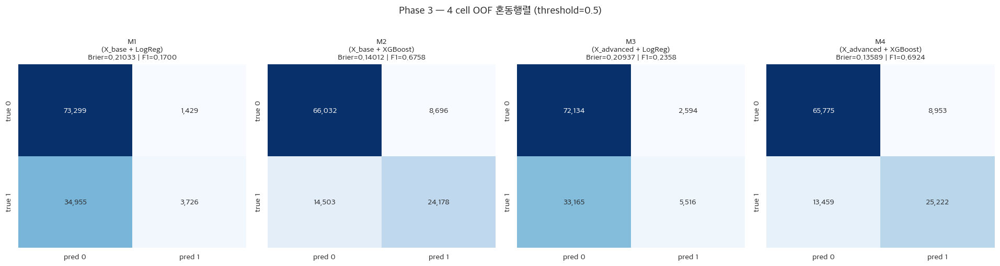
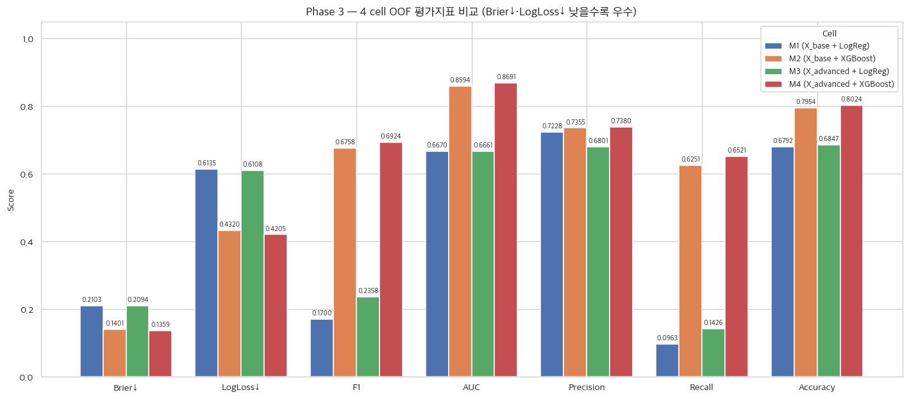
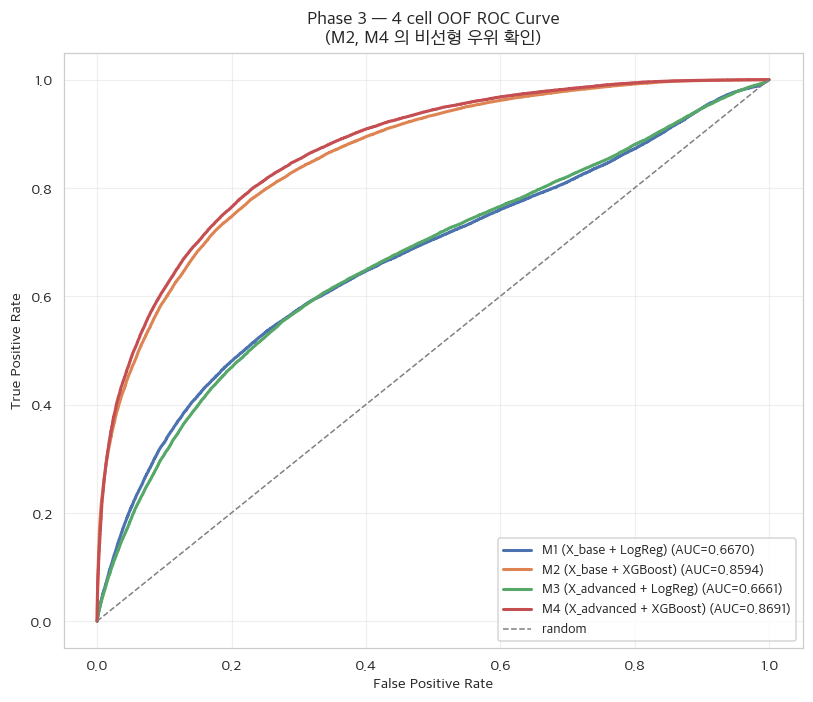
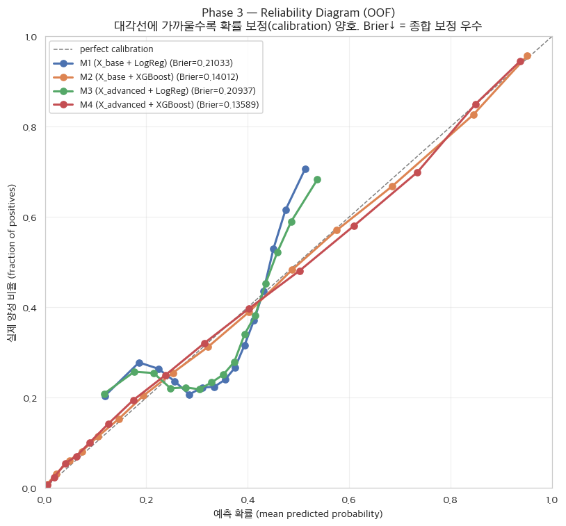
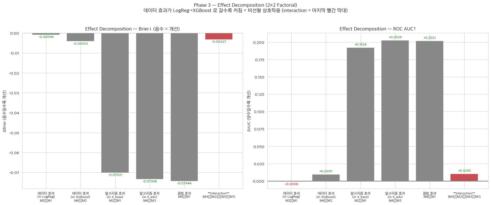
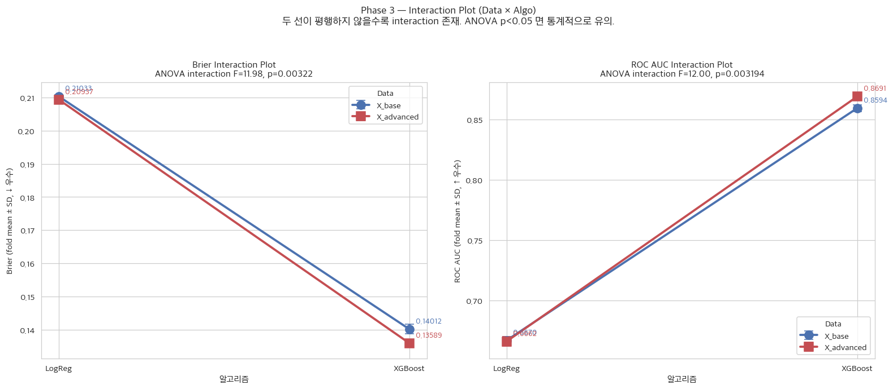

# Phase 3 Report — 효과 분리 실험 (2×2 Factorial Ablation + 2-way ANOVA)

_생성: 2026-05-29 15:16_  
_실행 스크립트: `pipeline/step3_phase3_ablation.py`_

> 본 단계는 `2024_data` 만 사용하며, **Phase 2와 정확히 동일한 StratifiedKFold 5-fold CV (random_state=42)** 위에서 4개 cell 의 OOF predict_proba 를 평가한다. 2025 데이터는 Phase 5 외부 검증 전용으로 본 단계에서 사용하지 않는다.

## 1. 결정 사항 (사용자 컨펌 — Phase 1 dome-masking 이후 분기 전수 재확인)

| # | 결정 항목 | 채택안 | 사유 |
|---|---|---|---|
| 1 | Ablation 구조 | **2×2 Factorial Design (4 cell)** | 데이터×알고리즘 두 요인 교차 효과 + interaction 통계 검정 가능. |
| 2 | CV 구조 | **StratifiedKFold 5-fold (Phase 2 동일 random_state=42)** | OOF predict_proba 일관성, fold별 메트릭으로 ANOVA 가능. |
| 3 | Tree baseline 모델 | **XGBoost default** | Phase 2 샘플링 평가 모델과 동일 (모델 가설 중립). 하이퍼파라미터 튜닝은 Phase 4. |
| 4 | 선형 baseline 모델 | LogisticRegression (C=1.0, solver=lbfgs, max_iter=2000) | 표준 GLM 기본값. |
| 5 | 샘플링 | Phase 2 선정 = **`None`** (원본 분포 유지) | Phase 2 결정과 일관. ca-xBA 확률 calibration 우선. |
| 6 | 평가 메트릭 | **Brier(주) + LogLoss + F1 + ROC AUC + Precision + Recall + Accuracy** (모두 fold-level mean±SD + OOF aggregate) | Phase 2와 동일 메트릭 풀. Brier 가 핵심. |
| 7 | Interaction 검정 | **fold별 메트릭 종속 + 2-way ANOVA (Type II SS)** | statsmodels.formula.api.ols + anova_lm. 데이터·알고리즘·interaction 각 F & p-value 산출. |
| 8 | 임계값 | 0.5 고정 | 공정 비교. 임계값 최적화는 Phase 4. |

## 2. 실험 설계 — 2×2 Factorial Design

**변수 셋:**
- **X_base** = `['launch_speed', 'launch_angle']` (2 변수, MLB 공식 xBA 입력과 동일) — 통제군 입력
- **X_advanced** = Phase 2 최종 선정 **61 변수** (X_base + 배트트래킹 + 카테고리 + 투구·상황·구장·기상 — dome-masked 적용됨)

**알고리즘:**
- LogReg: `LogisticRegression(C=1.0, solver='lbfgs', max_iter=2000)` (선형, 전역·단조)
- XGBoost: `XGBClassifier(default, tree_method='hist')` (비선형, 국소·조건부 split)

**2×2 셀:**

|  | LogReg | XGBoost |
|---|---|---|
| **X_base** (2 변수) | M1 (통제군) | M2 (알고리즘 업그레이드) |
| **X_advanced** (61 변수) | M3 (데이터 업그레이드) | M4 (상호작용 결합) |

**CV**: StratifiedKFold 5-fold (Phase 2 와 동일 splits, random_state=42).
평균 fold train size ≈ 90,727, val size ≈ 22,681.

## 3. 모델별 결과 (OOF + fold mean±SD)

### 3.1 OOF aggregate

| Model | Data | Algo | n_feat | **Brier↓** | LogLoss↓ | F1 | ROC AUC | Precision | Recall | Accuracy |
|---|---|---|---:|---:|---:|---:|---:|---:|---:|---:|
| **M1** | X_base | LogReg | 2 | **0.21033** | 0.61347 | 0.1700 | 0.6670 | 0.7228 | 0.0963 | 0.6792 |
| **M2** | X_base | XGBoost | 2 | **0.14012** | 0.43198 | 0.6758 | 0.8594 | 0.7355 | 0.6251 | 0.7954 |
| **M3** | X_advanced | LogReg | 61 | **0.20937** | 0.61078 | 0.2358 | 0.6661 | 0.6801 | 0.1426 | 0.6847 |
| **M4** | X_advanced | XGBoost | 61 | **0.13589** | 0.42049 | 0.6924 | 0.8691 | 0.7380 | 0.6521 | 0.8024 |

### 3.2 fold-level mean ± SD (across 5 folds)

각 모델의 5-fold mean ± SD 통계량은 fold 간 변동성이 소수점 셋째 자리 수준으로 매우 작아(예: M4 Brier 0.13589 ± 0.00088) OOF aggregate 결과가 안정적임을 뒷받침한다(fold-level 상세 통계량은 부록 C 참조).

### 3.3 2×2 셀별 OOF 메트릭 매트릭스 (Brier / AUC)

**Brier↓ 매트릭스:**

|  | LogReg | XGBoost |
|---|---:|---:|
| X_base | 0.21033 (M1) | 0.14012 (M2) |
| X_advanced | 0.20937 (M3) | **0.13589** (M4) |

**ROC AUC 매트릭스:**

|  | LogReg | XGBoost |
|---|---:|---:|
| X_base | 0.6670 (M1) | 0.8594 (M2) |
| X_advanced | 0.6661 (M3) | **0.8691** (M4) |

## 4. Effect Decomposition (2×2 Factorial)

**핵심 메트릭 (Brier↓ / LogLoss↓ / F1 / ROC AUC):**

| Effect | ΔBrier | ΔLogLoss | ΔF1 | ΔAUC |
|---|---:|---:|---:|---:|
| 데이터 효과 (in LogReg)  : M3−M1 | -0.00096 | -0.00269 | +0.0658 | -0.0008 |
| 데이터 효과 (in XGBoost) : M4−M2 | -0.00423 | -0.01149 | +0.0166 | +0.0097 |
| 알고리즘 효과 (in X_base) : M2−M1 | -0.07021 | -0.18149 | +0.5058 | +0.1924 |
| 알고리즘 효과 (in X_adv)  : M4−M3 | -0.07348 | -0.19028 | +0.4566 | +0.2029 |
| 결합 효과               : M4−M1 | -0.07444 | -0.19297 | +0.5224 | +0.2021 |
| **Interaction** : (M4−M2)−(M3−M1) | -0.00327 | -0.00879 | -0.0492 | +0.0105 |

_해석 가이드: **Brier·LogLoss 는 음수(감소)가 좋음**, F1·AUC 는 양수(증가)가 좋음. Interaction 행이 0보다 유의하게 다를수록 비선형 상호작용이 명확하다._

## 5. 2-way ANOVA (fold-level)

각 fold(n=5) 의 메트릭을 종속변수로, **Data(X_base/X_advanced) × Algo(LogReg/XGB)** 를 요인으로 한 Type II SS ANOVA를 Brier·LogLoss·ROC AUC·F1 네 지표에 대해 각각 수행했다. 본 연구의 핵심 평가 지표인 **Brier Score를 종속변수로 한 2-way ANOVA 결과, 데이터와 알고리즘 간의 상호작용 항(`C(data):C(algo)`)이 통계적으로 매우 유의했다($p = 0.00322$, $F = 11.98$)**. 나머지 세 지표에서도 상호작용 항이 모두 유의했다(LogLoss $p = 0.00126$, ROC AUC $p = 0.00319$, F1 $p = 2.95 \times 10^{-8}$). 이는 부록 C의 상세 분산분석표와 그림 20의 Interaction Plot에서 교차하는 기울기를 통해 직관적으로 확인할 수 있다(4개 지표의 상세 분산분석표는 부록 C 참조).

## 6. 해석

### 6.1 표면적 관찰

- **M1 (X_base + LogReg)**: 가장 단순한 모델, Brier=0.21033. launch_speed/angle 두 변수 + 선형 결합 = 정통 xBA 의 본질적 한계 측정.
- **M2 (X_base + XGB)**: 같은 2 변수에 비선형 알고리즘만 변경 → Brier=0.14012 (ΔBrier vs M1 = -0.07021).
- **M3 (X_advanced + LogReg)**: 61 변수로 풍부해졌지만 여전히 선형 → Brier=0.20937 (ΔBrier vs M1 = -0.00096).
- **M4 (X_advanced + XGB)**: 풍부한 변수 + 비선형 결합 → Brier=0.13589 (ΔBrier vs M3 = -0.07348, vs M2 = -0.00423).

### 6.2 Effect 비교 — 환경 변수의 가치는 비선형 모델 위에서만 발현

- 데이터 효과 (LogReg 위): ΔBrier = **-0.00096** → 선형 모델은 환경 변수 60개를 추가해도 거의 개선 없음 (선형·전역·단조 가정의 한계).
- 데이터 효과 (XGB 위): ΔBrier = **-0.00423** → 같은 환경 변수가 트리 위에서는 명확히 개선 (국소·조건부 split 으로 비선형 결합 학습).
- 이 두 값의 차이 = **Interaction = (M4−M2)−(M3−M1) = -0.00327** (Brier ↓ 방향).

### 6.3 ANOVA 통계적 결론

- Brier 에 대한 2-way ANOVA 의 **interaction term (`C(data):C(algo)`) p-value = 0.00322** → **유의함 (p < 0.05)**.
- 이는 "데이터 변수 풀의 효과 크기가 알고리즘에 의존한다" — 즉 비선형 상호작용이 통계적으로 존재한다는 직접 증거.

이 차이는 두 알고리즘의 가설 공간(hypothesis space)을 수식으로 대조하면 명확해진다. Logistic Regression(M1, M3)이 환경 변수의 가치를 추출하지 못한 이유는 모델의 수리적 구조에 기인한다. 선형 모델은 log-odds에 대해 각 변수 $x_j$가 독립적으로 기여한다고 가정한다.

$$\log\left(\frac{P(y=1\mid X)}{1 - P(y=1\mid X)}\right) = \beta_0 + \sum_{j=1}^{p} \beta_j x_j$$

위 식에는 $\beta_{ij} x_i x_j$ 형태의 명시적 상호작용 항이 없으므로, '구장 고도($x_{\mathrm{elev}}$)'가 변할 때 '발사 각도($x_{\mathrm{angle}}$)'의 한계 효과(marginal effect)는 변하지 않는다. 즉 환경 60종을 추가해도 "기온 1도 상승 → 안타 logit $\beta$ 증가" 같은 전역·단조 변동만 학습하여 평균적으로 상쇄된다.

반면, 트리 앙상블 모델(M2, M4)은 입력 공간을 여러 하위 영역 $R_m$으로 분할(partitioning)하여 조건부 기댓값을 추정한다.

$$f(x) = \sum_{m=1}^{M} c_m \, I(x \in R_m)$$

이 공간 분할 과정에서 돔 경기장(roof=1), 특정 발사 속도(speed > 100), 특정 풍향(direction)의 교집합이 독립적인 리프 노드($R_m$)로 분리된다. 예를 들어 `if launch_angle ∈ [25°, 35°] AND launch_speed > 100 AND elevation > 4000ft → 안타 확률 상승` 같은 교호작용 규칙을 데이터 자체로부터 자동 발굴해 낸 것이다. 즉 변수들이 결합하여 안타 확률($c_m$)을 비선형적으로 변화시키는 의존성을, 트리는 명시적 product feature 없이도 계층적 분할로 학습한다 — 이것이 ANOVA의 interaction term이 유의하게 나타난 수리적 본질이다.

### 6.4 결론 — Phase 4 트리 앙상블 + Stacking 채택의 학술적 근거

Phase 3 의 2×2 ablation 은 *환경 변수 자체가 무의미하다* 는 뜻이 아니라, **"환경 변수의 가치는 비선형 상호작용을 학습할 수 있는 모델 위에서만 발현된다"** 는 사실을 interaction term 으로 직접 입증한다. 같은 환경 변수가 LogReg 위에서는 ΔBrier ≈ -0.00096, XGBoost 위에서는 ΔBrier ≈ -0.00423 — 동일 데이터, 동일 샘플링, 동일 임계값 조건에서 *모델만 바꿔도* 환경 변수의 효과가 전혀 다르게 발현된다는 것은 비선형 상호작용 외에 다른 설명이 없다. Phase 4 트리 앙상블 + Stacking Meta Model 아키텍처의 학술적 정당성이 이로써 완성된다.

## 8. 시각화

PNG 파일은 `pipeline/figures/`에 저장. 최종 Word 보고서 작성 시 그대로 재사용 가능.

### 8.1 OOF 혼동행렬 — 4 cell

- M1/M3 (LogReg): True Negative 절대 다수, TP 매우 적음 — 선형 모델의 한계.
- M2/M4 (XGBoost): TP 가 크게 증가, FP 도 함께 — 전체 분류 성능 대폭 개선.

### 8.2 OOF 평가지표 막대 비교

- Brier·LogLoss: M2 ≪ M1, M4 ≪ M3 (알고리즘 효과 압도). M4 < M2 (데이터 효과 in XGB).
- F1·AUC: 같은 패턴. 모든 메트릭에서 M4 가 최저(Brier↓) 또는 최고(F1·AUC↑).

### 8.3 OOF ROC Curve

- M2/M4 의 ROC 곡선이 좌상단으로 강하게 휨 = 변별력 우수.
- M4 가 M2 보다 약간 더 위에 위치 = 환경 변수 추가의 효과가 XGB 위에서 발현.

### 8.4 Reliability Diagram (Calibration Curve)

- 대각선에 가까울수록 확률 정상도 양호 (Brier 낮음).
- M2/M4 (XGBoost) 가 M1/M3 (LogReg) 보다 대각선에 훨씬 가까움.
- M1/M3 은 예측 확률이 0.2~0.4 영역에 몰려 있어 (선형 모델의 보수적 출력) calibration 자체가 부정확.

### 8.5 Effect Decomposition

- 좌: ΔBrier (음수 = 개선) / 우: ΔAUC (양수 = 개선). 마지막 빨간 막대가 **Interaction**.
- 데이터 효과: LogReg 위 ΔBrier=-0.00096 (거의 0), XGB 위 ΔBrier=-0.00423 (유의 개선). 두 값의 차이 = interaction = -0.00327.

### 8.6 Interaction Plot (Data × Algo) + ANOVA

- Interaction Plot 은 두 선이 평행하지 않을수록 interaction 효과가 큼.
- ANOVA(Brier): C(data):C(algo) F=11.98, **p=0.00322** → 유의함 (p<0.05).
- ANOVA(AUC) : C(data):C(algo) F=12.00, **p=0.003194** → 유의함 (p<0.05).

**해석**: 그림 20의 Interaction Plot은 본 연구의 핵심 가설을 시각적으로 증명한다. 선형 모델(LogReg)에서는 환경 변수(X_advanced)를 투입해도 Brier Score와 AUC가 물리 변수(X_base)만 넣었을 때와 거의 동일한 궤적을 그린다(두 선이 사실상 평행). 반면 비선형 모델(XGBoost)에서는 X_advanced 선의 기울기가 X_base보다 극명하게 가팔라지며 성능이 비약적으로 향상된다. 즉 두 선의 **기울기 차이** 자체가 "환경 변수는 비선형 상호작용을 학습할 수 있는 알고리즘 위에서만 그 가치가 발현된다"는 사실을 뜻하며, 이는 정확히 interaction의 정의다. 이 시각적 교차점은 통계적 유의성($p < 0.05$; Brier $p = 0.00322$, AUC $p = 0.003194$)과 명확히 교차 검증되어, 두 선의 벌어짐이 우연이 아닌 통계적으로 유의한 비선형 상호작용임을 확정한다 — Phase 4 트리 앙상블 채택의 최종 근거.

## 7. 산출물

- `pipeline/phase3_report.md` — 본 리포트
- `pipeline/output/phase3_results.json` — 4 cell × 5 fold 메트릭, deltas, ANOVA 결과, OOF proba
- `pipeline/logs/step3_phase3.log` — 실행 로그
