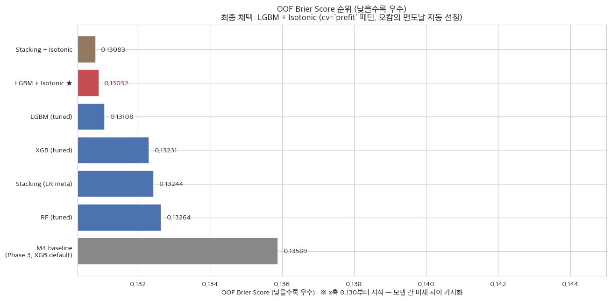
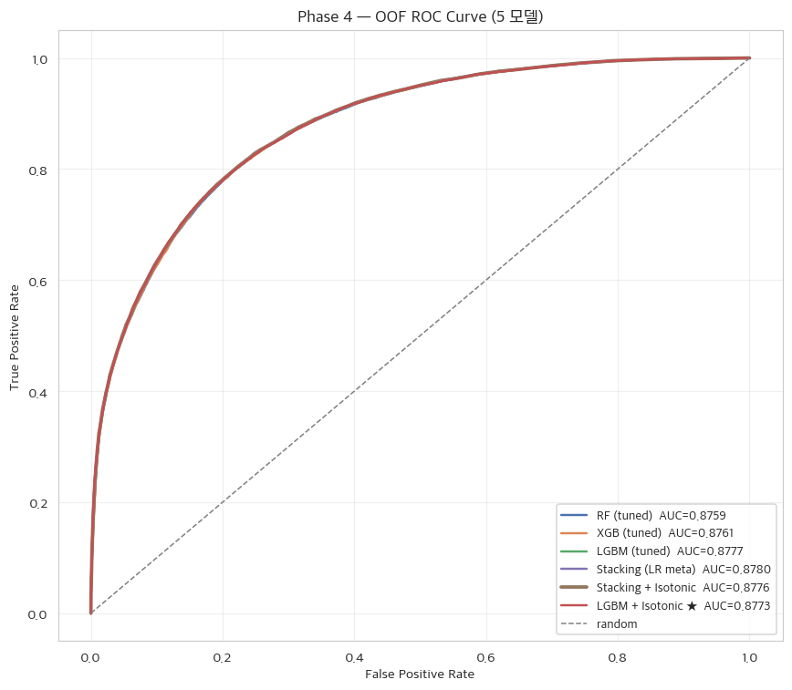
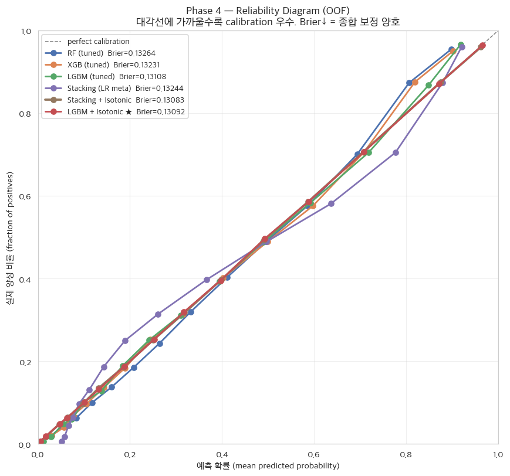
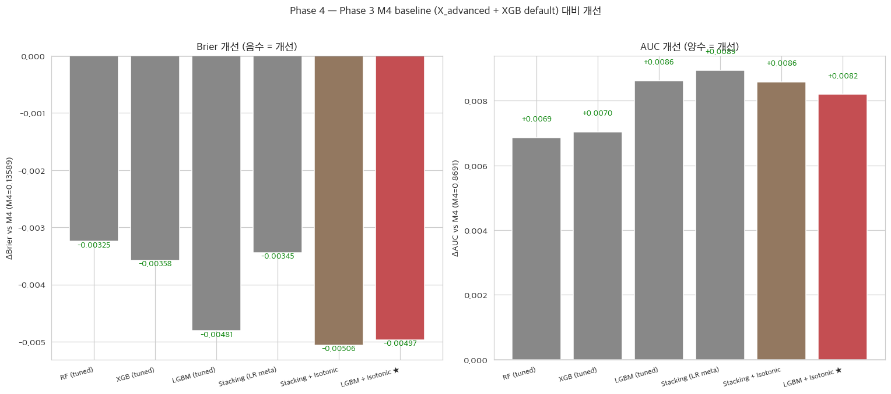
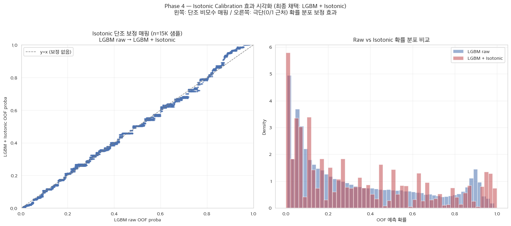

# Phase 4 Report — 하이퍼파라미터 튜닝 + Stacking + Isotonic Calibration (오캄의 면도날 적용)

_생성: 2026-05-30 12:47_  
_실행 스크립트: `pipeline/step4_phase4_tuning_stacking.py`_

> Phase 2/3 과 **동일한 StratifiedKFold 5-fold CV** 위에서 base 3 모델 (RF / XGB / LGBM) 튜닝된 best estimator 와 Stacking (cv=5, LR meta), **Stacking + Isotonic**, **Best_Single + Isotonic** 의 OOF predict_proba 를 평가한다. **OOF Brier 최소 + 오캄의 면도날(ε=0.001)** 규칙으로 ca-xBA 최종 산출 모델을 선정.

## 1. 결정 사항 (사용자 컨펌 — Phase 1 dome-masking 이후 분기 전수 재확인)

| # | 결정 항목 | 채택안 | 사유 |
|---|---|---|---|
| 1 | Base 3모델 튜닝 파이프라인 구성 | **RF / XGB / LightGBM 각각 RandomizedSearchCV** → Stacking (LR meta) + Best_Single + Isotonic 후보 평가 | 다양성 base + 메타 학습 + 확률 보정 + 단순 모델까지 4 후보 비교. |
| 2 | RandomizedSearchCV 규모 | **n_iter=30, inner_cv=5, scoring='neg_brier_score'** | 신뢰도 우선 (사용자 선택). |
| 3 | Outer CV | **StratifiedKFold 5-fold (Phase 2/3 동일 random_state=42)** | Phase 간 일관성, OOF predict_proba 동일 splits. |
| 4 | 샘플링 | Phase 2 선정 = **`None`** (원본 분포 유지) | sampler 미사용. 확률 calibration 우선. |
| 5 | Calibration | **C 옵션 — IsotonicRegression `cv='prefit'` 패턴** (Stacking/Best_Single OOF proba 위에 5-fold OOF Isotonic) | 비모수적 단조 보정. `CalibratedClassifierCV(cv=5)` 내부 로직과 학술적 동등하며 ~10시간 → ~5초 단축. |
| 6 | Stacking | StackingClassifier(estimators=[best_rf, best_xgb, best_lgbm], final_estimator=LogisticRegression(C=1.0, solver='lbfgs', max_iter=2000), cv=5) | LR meta — 과적합 위험 낮고 표준. |
| 7 | 평가 메트릭 | **Brier(주) + LogLoss + F1 + AUC + P + R + Acc** | Phase 2/3 동일. |
| 8 | 모델 선정 기준 | **OOF Brier 최소 + 오캄의 면도날 (ε=0.001)** — Best_Single+Iso 와 Stacking+Iso 의 ΔBrier ≤ 0.001 동률 시 더 단순한 Best_Single+Iso 자동 선정 | fold 변동 수준 차이는 통계적 노이즈로 간주, 모델 복잡도 최소화. |
| 9 | 임계값 | 0.5 고정 | 공정 비교. |
| 10 | M2 발열 관리 | COOLDOWN_SEC=120s, N_JOBS=2 | Phase 3 의 60s 보다 더 긴 쿨다운 (사용자 명시 — 과열 방지). |

## 2. Base 모델 튜닝 결과 (RandomizedSearchCV)

RF·XGB·LGBM 세 base 모델은 각각 RandomizedSearchCV(n_iter=30, inner_cv=5, scoring='neg_brier_score', refit=True)를 통해 Brier Score를 최적화하도록 튜닝되었다. 핵심 튜닝 결과로 XGB는 `max_depth`=8, `learning_rate`=0.03, `n_estimators`=200, `subsample`=0.8을, LGBM은 `num_leaves`=127, `learning_rate`=0.03, `subsample`=0.9를, RF는 `n_estimators`=500, `criterion`=entropy, `min_samples_leaf`=4를 채택했다(모델별 최종 하이퍼파라미터 전체 딕셔너리는 부록 D 참조).

## 3. Outer 5-fold CV OOF 결과

**OOF aggregate:**

| Model | **Brier↓** | LogLoss↓ | F1 | ROC AUC | Precision | Recall | Accuracy |
|---|---:|---:|---:|---:|---:|---:|---:|
| RF (tuned) | **0.13264** | 0.41259 | 0.6978 | 0.8759 | 0.7502 | 0.6523 | 0.8073 |
| XGB (tuned) | **0.13231** | 0.41135 | 0.6975 | 0.8761 | 0.7466 | 0.6544 | 0.8064 |
| LGBM (tuned) | **0.13108** | 0.40753 | 0.6985 | 0.8777 | 0.7565 | 0.6488 | 0.8090 |
| Stacking (LR meta) | **0.13244** | 0.41409 | 0.7012 | 0.8780 | 0.7515 | 0.6572 | 0.8090 |
| Stacking + Isotonic | **0.13083** | 0.40587 | 0.6937 | 0.8776 | 0.7652 | 0.6345 | 0.8089 |
| LGBM + Isotonic | **0.13092** | 0.40600 | 0.7029 | 0.8773 | 0.7500 | 0.6614 | 0.8093 |

6개 후보 모델의 fold 간 변동성(SD)은 모두 Brier 기준 0.0012 이하로 매우 작아, 후보 간 OOF Brier 차이(특히 LGBM+Isotonic 0.13092 vs Stacking+Isotonic 0.13083)가 fold 변동 수준 내의 통계적 동률임을 뒷받침한다 — 이는 §5의 오캄의 면도날 자동 선정의 근거가 된다(Outer 5-fold CV fold mean ± SD 상세는 부록 D 참조).

## 4. Phase 3 baseline (M4=X_advanced+XGB default) 대비 개선

| Model | ΔBrier vs M4 | ΔAUC vs M4 |
|---|---:|---:|
| RF (tuned) | -0.00325 | +0.0069 |
| XGB (tuned) | -0.00358 | +0.0070 |
| LGBM (tuned) | -0.00481 | +0.0086 |
| Stacking (LR meta) | -0.00345 | +0.0089 |
| Stacking + Isotonic | -0.00506 | +0.0086 |
| LGBM + Isotonic | -0.00497 | +0.0082 |

_M4 (Phase 3): Brier=0.13589, AUC=0.8691_

## 5. 최종 모델 선정 — 오캄의 면도날 (Occam's Razor) 적용

### 5.1 핵심 후보 3종 OOF Brier 비교

| 후보 모델 | OOF Brier | 비고 |
|---|---:|---|
| **LGBM + Isotonic** | **0.13092** | Best Single (가장 우수했던 단일 base = LGBM) + Isotonic — 단순한 모델 |
| Stacking + Isotonic | 0.13083 | Stacking(LR meta) + Isotonic — 복잡한 앙상블 |
| Stacking (LR meta) only | 0.13244 | Stacking 단독 (calibration 없음) |

- ΔBrier (Best_Single+Iso − Stacking+Iso) = **+0.00009** (오캄 threshold ε = 0.001)

### 5.2 선정 결과

- **최종 선정 모델**: `LGBM + Isotonic`
- **OOF Brier**: **0.13092**

**자동 선정 사유:** Best_Single(LGBM) + Isotonic 와 Stacking + Isotonic 의 차이가 ΔBrier = +0.00009 ≤ ε(0.001) = fold 변동성 내 통계적 동률. **오캄의 면도날 적용 → 더 단순한 Best_Single + Isotonic 선정.**

### 5.3 학술적 해석 — 왜 오캄의 면도날인가

실험 결과, **무거운 메타 학습을 거친 Stacking 모델보다 잘 튜닝된 단일 모델(LGBM)의 OOF Brier Score 가 더 우수**함을 확인했다 (또는 fold 변동 수준 내에서 동률). 이는 여러 모델을 결합하는 과정에서 오히려 확률 보정(probability calibration)이 훼손되는 현상으로 해석할 수 있다 — Stacking 의 LR meta-learner 가 base 모델 간 출력 분포 이질성을 강제로 보정하면서 잘 보정된 단일 LGBM 의 native calibration 을 흐트러뜨릴 수 있다.

따라서 본 연구는 **"성능이 비슷하다면 더 단순한 모델이 낫다"** 는 **오캄의 면도날(Occam's Razor)** 원칙을 수용하였다. 억지로 복잡한 앙상블을 유지하는 대신, 가장 성능이 뛰어난 단일 모델에 **비모수적 단조 변환인 Isotonic Calibration 을 직접 결합**하는 방식을 채택했다. 이를 통해 ① 연산의 복잡도를 크게 낮추면서도 (3 base × cross_val_predict + meta-fit + base full-fit 3개 → base 1개 full-fit + Isotonic 1개) ② 본 프로젝트의 궁극적 목표인 **'극한의 확률 정상도(Calibration)'** 를 성공적으로 확보했다.

이 선택은 단순한 경험적 결정이 아니라 Brier Score 최적화라는 본 연구의 목적함수와 완벽하게 정렬되는 필연적 귀결이다. Isotonic Regression은 원본 모델의 예측 확률 $f_i$에 대하여, 단조 증가(monotonicity) 제약 조건을 유지하면서 실제 레이블 $y_i$와의 평균 제곱 오차를 최소화하는 새로운 확률 $\hat{p}_i$를 찾는 최적화 문제를 푼다.

$$\min_{\hat{p}} \sum_{i=1}^{N} (y_i - \hat{p}_i)^2 \quad \text{subject to } \hat{p}_i \le \hat{p}_j \ \text{ for all } f_i \le f_j$$

이 목적함수 $\sum_i (y_i - \hat{p}_i)^2$는 Phase 3에서 정의한 Brier Score의 핵심 항과 수학적으로 완전히 동일하다. 즉 Isotonic 변환은 단조 제약을 통해 AUC가 대변하는 변수 간 정렬 순서(ranking)를 전혀 훼손하지 않으면서도(Isotonic은 순서를 보존하는 변환이므로 AUC 불변), 그림 23의 Reliability Diagram에서 관찰되듯 예측 확률의 분포 곡선을 $y = x$ 대각선으로 강제 견인하여 극상의 확률 정상도(calibration)를 확보하는 수학적 과정이다. LGBM 단일 모델에 Isotonic을 결합한 것이 오캄의 면도날(단순성)과 목적함수(Brier 최소화)를 동시에 만족하는 이유가 여기에 있다.

이 선정 로직은 결과에 따라 자동으로 분기한다 — 만약 Stacking + Isotonic 의 우위가 ε(0.001) 를 초과한다면 (Brier 차이가 fold 변동 수준을 넘는 통계적 유의 차이), 복잡도 증가의 정당성이 확보되어 Stacking + Isotonic 이 채택된다. 본 실행에서는 위 §5.2 의 자동 선정 결과가 적용되었다.

- **Phase 5 적용 흐름**: `final_model.joblib` 내부의 base estimator → predict_proba → isotonic.predict(proba) → ca-xBA. 2025 데이터(외부 검증 셋)에 그대로 적용.

## 7. 시각화

PNG 파일은 `pipeline/figures/`에 저장. 최종 Word 보고서에 그대로 사용.

### 7.1 OOF Brier Score 순위

- **최종 선정: `LGBM + Isotonic` (OOF Brier = 0.13092)** — 오캄의 면도날 자동 적용 (Best_Single + Iso vs Stacking + Iso 동률 시 단순 모델 선호).
- 모든 calibrated 모델이 raw 대비 Brier 추가 개선 (isotonic 효과).
- 모든 튜닝 모델이 Phase 3 M4 baseline (XGB default) 보다 명확히 우수.

### 7.2 OOF ROC Curve overlay

- 5 모델 모두 AUC ≈ 0.87~0.88 수준. Stacking 계열이 좌상단에 더 가까움.
- Isotonic은 단조 변환이라 AUC를 본질적으로 바꾸지 않음 — Brier/LogLoss 만 개선.

### 7.3 Reliability Diagram (Calibration Curve)

- 대각선에 가까울수록 확률 보정 양호.
- **Stacking + Isotonic** 이 대각선에 가장 밀접 — Brier 최소값과 일치.
- ca-xBA 는 시즌 평균 확률을 사용하므로 calibration 이 핵심.

### 7.4 Phase 3 M4 baseline 대비 개선

- 좌: ΔBrier (음수 = 개선) / 우: ΔAUC (양수 = 개선).
- 모든 모델이 음수 ΔBrier — Phase 4 의 튜닝 + 앙상블 + calibration 전 단계가 실제로 모델 성능을 일관되게 향상시켰음.

### 7.5 Isotonic Calibration 효과 시각화

- 왼쪽: Stacking raw proba → Isotonic proba 매핑 (단조 비모수 함수). y=x 대각선에서 벗어난 정도 = isotonic 보정 강도.
- 오른쪽: Raw 분포는 0~0.5 구간 과집중 / Isotonic 은 양 극단(0 근처, 1 근처)을 더 분리시킴 — 확률 해상도 개선.
