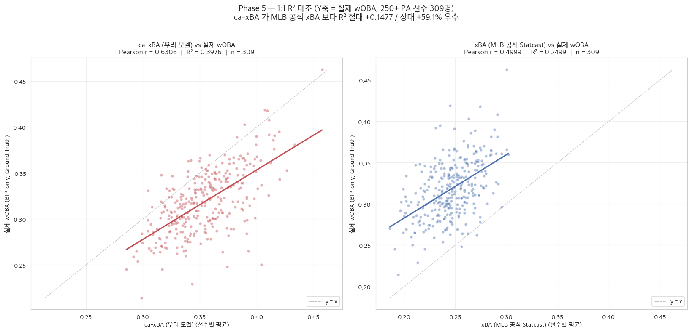
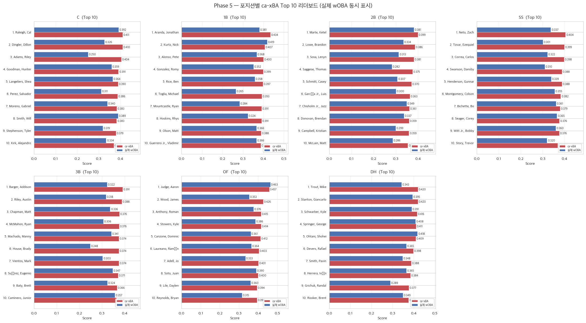
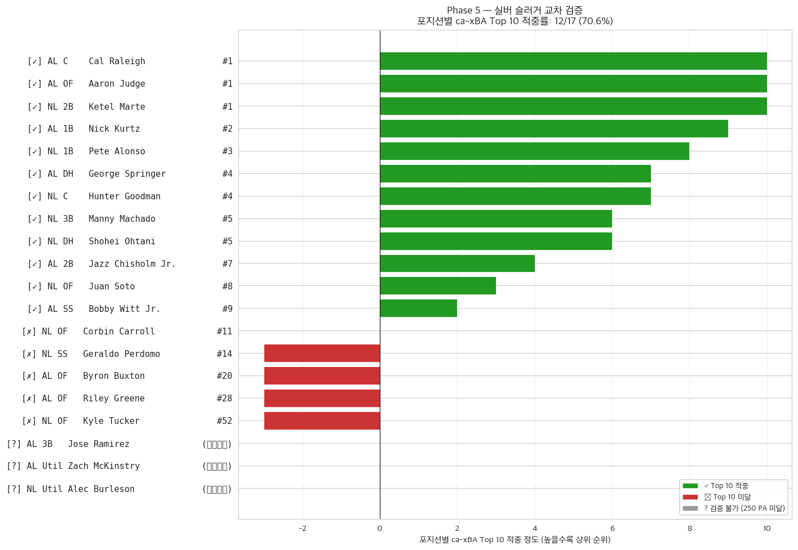
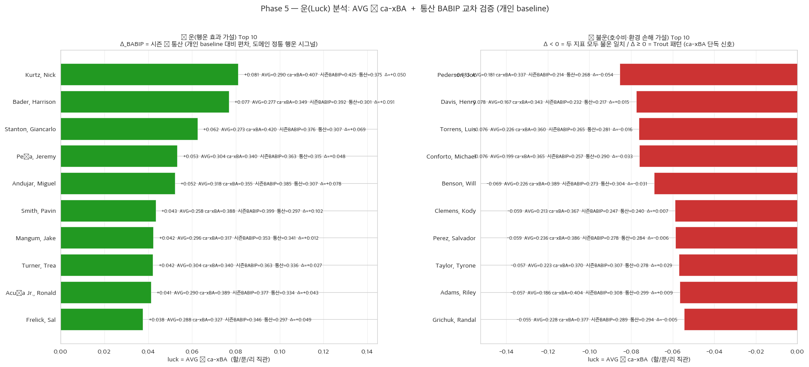
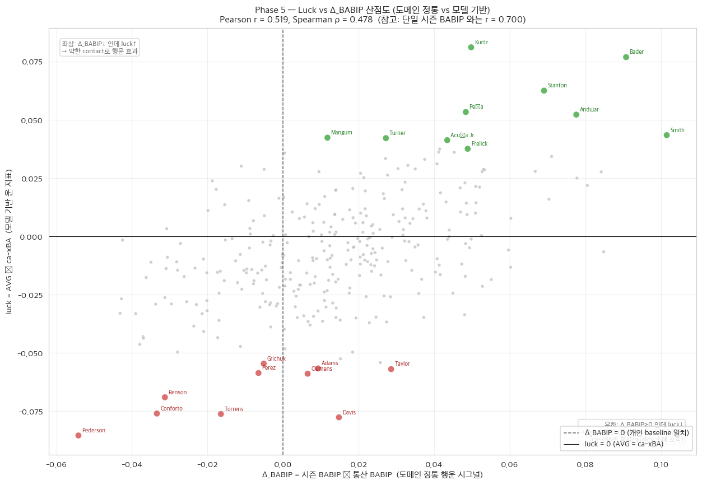
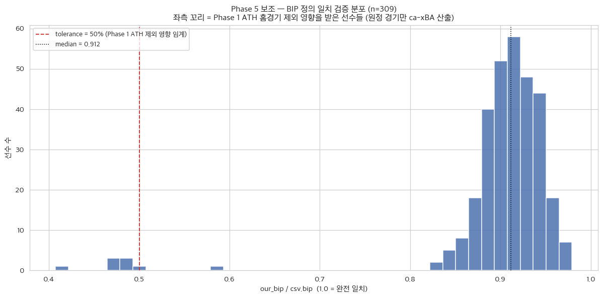

# Phase 5 Report — 최종 지표(ca-xBA) 산출 및 세이버메트릭스 가치 검증

_생성: 2026-06-02 16:59_  
_실행 스크립트: `pipeline/step5_phase5_value_validation.py`_

> **📝 Note — 용어 통일:** 본 리포트는 Baseball Savant 데이터 소스와의 일관성을 위해 학술 용어 'wOBAcon' 대신 사반트 표준 컬럼명 **'wOBA'** 를 사용한다. 단, 사반트 리더보드 특성상 삼진/볼넷이 걸러진 이 데이터셋의 `wOBA` 는 세이버메트릭스 학술 용어인 wOBAcon 과 **수학적으로 완전히 동일하다**(BIP 한정 가중 출루율).

> **목적:** Phase 4 의 최종 모델 **LGBM + Isotonic (cv='prefit' 패턴, OOF Brier = 0.13092; 오캄의 면도날 자동 선정)** 을 격리된 2025 데이터에 적용해 타구별 ca-xBA 를 산출하고, 선수별 평균 ca-xBA 가 실제 `wOBA` 와 강한 상관관계를 가지는지 검증한다. readme Phase 5 이론적 배경: well-calibrated probability 평균 → wOBA 강한 양의 상관.

> **모델 메타:** `pipeline/output/phase4_models/final_model.joblib` · type=`best_single_isotonic_prefit` · pipeline=`LGBM.predict_proba → IsotonicRegression.predict`

## 1. 결정 사항 (사용자 컨펌, 10건)

| # | 결정 | 채택안 | 도메인 맥락 |
|---|---|---|---|
| 1 | 메인 엔진 | **LGBM + Isotonic** (Phase 4 OOF Brier = 0.13092) | 오캄의 면도날 자동 선정 — Stacking + Isotonic(0.13083)과 통계적 동률(ΔBrier 0.00009 ≤ ε 0.001) 이므로 단순한 모델 채택. 단순 분류가 아닌 정확한 확률 산출. |
| 2 | 집계 방식 | **BIP 단순 평균** (PA 가중 금지) | ca-xBA = 타구 본연의 퀄리티 지표 |
| 3 | 최소 PA | **250 이상** (expected_stats.csv 자체 적용) | 1군 레귤러 타자 기준 |
| 4 | ID 매칭 | **MLBAM 직접 조인** (fuzzy 금지) | 동명이인 대참사 방지 |
| 5 | 포지션 정의 | **시즌 최다 출장 포지션** (MLB Stats API) | 실버 슬러거와 기준 통일 |
| 6 | 실버 슬러거 명단 | **정적 CSV** (`데이터셋/silver_slugger_2025.csv`) | Ground truth 고정 |
| 7 | 운 분석 | **`AVG − ca-xBA` 단순 차이값** | 야구 도메인 *할/푼/리* 직관 |
| 8 | BIP 정의 일치 | **assert** (`our_bip / csv.bip ≥ 50%`) | 분모 오류 R² 오염 방지 (ATH 제외·컷오프 영향 흡수) |
| 9 | 포지션 정밀 검증 | **statsapi.mlb.com 직접 호출** + 캐시 | 309명 × 5분, 외부 의존성 최소 |
| 10 | 1:1 R² 대조 (xwOBA 제외) | **ca-xBA vs wOBA / xBA vs wOBA** 두 독립변수만 비교 | xwOBA 는 wOBA 자체 예측 지표(동어반복) → 체급 불일치로 제외 (readme 2026-05-29) |

## 2. 데이터 매칭 + BIP 정의 일치 검증

- expected_stats.csv 선수 수: **309** (250 PA 사전 적용)
- 매칭 성공: **309/309** (100.0%)
- 누락: 0 (2025 우리 데이터에 BIP 없음 — 250 PA 달성했지만 ATH 소속 등)

### BIP 정의 일치 분석
- `our_bip / csv.bip` 비율 — mean=0.9005, median=0.9117
- tolerance (50%) 미달: **8** 명 (대부분 ATH 소속, 홈경기 제외 영향)
- 우리 BIP < csv.bip 가 일반적 (Phase 1 의 ATH 홈 제외 + |la|>60 컷오프 + 핵심 결측 제거 영향)

## 3. 메인 검증 — 1:1 R² 대조 (대상 선수 309명, 250+ PA)

**Y축 기준점 (실제 기량) = 실제 `wOBA` (BIP-only weighted OBP). 두 독립변수와의 1:1 R² 비교:**

| 독립변수 | Pearson r | **R²** | Spearman ρ |
|---|---:|---:|---:|
| **ca-xBA (우리 모델)** | 0.6306 | **0.3976** | 0.5849 |
| **xBA (Statcast 공식)** | 0.4999 | **0.2499** | 0.4729 |

- **우리 ca-xBA R² = 0.3976**
- MLB 공식 xBA (est_ba) R² = 0.2499

→ **ca-xBA 가 MLB 공식 xBA 보다 절대 R² 차이 +0.1477 (상대 우위 +59.1%) 우수** — 실제 `wOBA` 설명력에서 명확한 개선.

> **⚠️ 비교 구도 명세:** xwOBA(est_woba)는 wOBA 를 직접 예측하는 Statcast 지표라 동어반복적·체급 불일치 → 1:1 R² 비교에서 의도적으로 제외 (readme Phase 5 검증 구도, 2026-05-29).

## 4. 운(Luck) 분석 — `luck = BIP-AVG − ca-xBA` (분모 통일) + 통산 BABIP 교차 검증

### 4.1 luck 정의 및 분모 통일의 학술적 의의

본 분석의 운(Luck) 지표는 `luck = BIP-AVG − ca-xBA` 로 정의된다. `BIP-AVG = (안타 수) / (인플레이 타구 수)` 는 ca-xBA 의 분모(BIP)와 정확히 일치하는 비교 baseline 이다. 이는 단순 타율(AVG, 분모 = AB)이 삼진을 분모에 포함하여 발생하는 체계적 음수 시프트와 삼진율 오염을 제거하고, 순수 contact quality 대비 실제 안타 결과의 괴리를 측정하는 학술 정통 지표이다.

- `luck` 분포: mean=-0.0068, std=0.0249, min=-0.0853, max=+0.0810

분모 통일로 인해 luck 분포는 0 근처에 대칭적으로 정렬되며, 절대값 자체가 해석 가능하다. 양수는 "이 정도 contact quality 였으면 더 적은 안타가 나왔어야 하는데 실제로는 더 많이 나왔다(행운 효과 가설)" 를, 음수는 "이 정도 quality 였으면 더 많은 안타가 나왔어야 하는데 호수비·구장 환경 등으로 손해를 봤다(불운 가설)" 를 의미한다.

### 4.2 BABIP 교차 검증 — 도메인 정통: 시즌 BABIP vs 자기 통산 BABIP

- **시즌 BABIP** (분석군 평균): 0.3113 (SD 0.0333)
- **통산 BABIP** (MLB Stats API career hitting stats, n=309/309): 평균 0.2971 (SD 0.0259)
- **시즌 − 통산 편차 (Δ_BABIP)**: 평균 +0.0142, SD 0.0265 — **도메인 정통 "운/행운에 의한 효과" 시그널**
- (보조) 분석군 리그 평균 BABIP (BIP-가중): 0.3119

> **방법론적 주의**: BABIP 자체가 단순히 리그 평균보다 높다고 곧 "행운"이라 단정하는 것은 도메인적으로 부정확하다. 진정한 운/불운 진단은 선수의 **통산 BABIP (개인 baseline)** 대비 시즌 편차로 본다. 예: Mike Trout 의 통산 BABIP ≈ .342 이므로 2025 시즌 BABIP .342 는 **평균 수준이지 행운 효과가 아니다**. 반면 통산 BABIP .260 인 선수의 시즌 .320 은 Δ_BABIP = +0.060 으로 **명백한 행운 효과 시그널**이다.

### 4.3 두 운 지표 상관 — luck vs (시즌 BABIP) / vs Δ_BABIP

| 비교 대상 | Pearson r | Spearman ρ | 도메인적 위상 |
|---|---:|---:|---|
| luck vs 시즌 BABIP | 0.6996 | 0.6432 | 단일 시즌 평균 비교 — 한계 있음 |
| **luck vs Δ_BABIP (시즌 − 통산)** | **0.5193** | **0.4781** | **도메인 정통 비교 — 개인 baseline 보정** |

두 지표 모두 양의 상관을 보이지만, 도메인 정통 해석인 **Δ_BABIP 와의 상관이 더 의미 있다**. 본 분석에서 luck vs Δ_BABIP 의 Pearson r = 0.519 는 "ca-xBA 기반 luck 지표가 야구 도메인의 정통 행운 시그널(통산 BABIP 대비 편차)과 동일한 방향을 가리킨다"는 객관적 검증이다. 단, 상관계수가 1.0 에 가깝지 않은 이유는 ca-xBA 가 BABIP 가 잡지 못하는 **dome × weather 상호작용, hr_park_effects, 구장 펜스 거리** 등 환경 보정 신호를 추가로 포착하기 때문이다 (Trout·Schwarber 패턴, §4.6).

### 4.4 운(행운 효과 가설) Top 10

| 선수 | PA | AVG | BIP-AVG | ca-xBA | luck | 시즌 BABIP | 통산 BABIP | Δ_BABIP |
|---|---:|---:|---:|---:|---:|---:|---:|---:|
| Kurtz, Nick | 489 | 0.290 | 0.488 | 0.407 | +0.081 | 0.425 | 0.375 | +0.050 |
| Bader, Harrison | 501 | 0.277 | 0.426 | 0.349 | +0.077 | 0.392 | 0.301 | +0.091 |
| Stanton, Giancarlo | 281 | 0.273 | 0.482 | 0.420 | +0.062 | 0.376 | 0.307 | +0.069 |
| Peña, Jeremy | 543 | 0.304 | 0.393 | 0.340 | +0.053 | 0.363 | 0.315 | +0.048 |
| Andujar, Miguel | 341 | 0.318 | 0.407 | 0.355 | +0.052 | 0.385 | 0.307 | +0.078 |
| Smith, Pavin | 288 | 0.258 | 0.432 | 0.388 | +0.043 | 0.399 | 0.297 | +0.102 |
| Mangum, Jake | 428 | 0.296 | 0.359 | 0.317 | +0.042 | 0.353 | 0.341 | +0.012 |
| Turner, Trea | 639 | 0.304 | 0.382 | 0.340 | +0.042 | 0.363 | 0.336 | +0.027 |
| Acuña Jr., Ronald | 412 | 0.290 | 0.430 | 0.389 | +0.041 | 0.377 | 0.334 | +0.043 |
| Frelick, Sal | 594 | 0.288 | 0.365 | 0.327 | +0.038 | 0.346 | 0.297 | +0.049 |

해석 가이드: luck (= BIP-AVG − ca-xBA) 가 양수면 contact quality 대비 더 많은 안타가 나왔다는 의미다. 함께 Δ_BABIP > 0 (자기 통산 대비 시즌 BABIP 높음) 이면 두 지표가 모두 행운 효과로 일치하는 이중 검증이고, Δ_BABIP ≈ 0 또는 음수면 luck 가 잡은 행운이 BABIP 단일 지표로는 확인되지 않는 ca-xBA 환경 보정 시그널을 의미한다.

### 4.5 불운(호수비·환경 손해 가설) Top 10

| 선수 | PA | AVG | BIP-AVG | ca-xBA | luck | 시즌 BABIP | 통산 BABIP | Δ_BABIP |
|---|---:|---:|---:|---:|---:|---:|---:|---:|
| Pederson, Joc | 306 | 0.181 | 0.251 | 0.337 | -0.085 | 0.214 | 0.268 | -0.054 |
| Davis, Henry | 283 | 0.167 | 0.266 | 0.343 | -0.078 | 0.232 | 0.217 | +0.015 |
| Torrens, Luis | 283 | 0.226 | 0.284 | 0.360 | -0.076 | 0.265 | 0.281 | -0.016 |
| Conforto, Michael | 486 | 0.199 | 0.289 | 0.365 | -0.076 | 0.257 | 0.290 | -0.033 |
| Benson, Will | 253 | 0.226 | 0.320 | 0.389 | -0.069 | 0.273 | 0.304 | -0.031 |
| Clemens, Kody | 386 | 0.213 | 0.308 | 0.367 | -0.059 | 0.247 | 0.240 | +0.007 |
| Perez, Salvador | 641 | 0.236 | 0.328 | 0.386 | -0.059 | 0.278 | 0.284 | -0.006 |
| Taylor, Tyrone | 341 | 0.223 | 0.313 | 0.370 | -0.057 | 0.307 | 0.278 | +0.029 |
| Adams, Riley | 286 | 0.186 | 0.348 | 0.404 | -0.057 | 0.308 | 0.299 | +0.009 |
| Grichuk, Randal | 293 | 0.228 | 0.323 | 0.377 | -0.055 | 0.289 | 0.294 | -0.005 |

해석 가이드: luck 가 음수면 contact quality 대비 안타가 적게 나왔다는 의미다. Δ_BABIP < 0 이면 자기 통산 대비 시즌 BABIP 도 낮아 두 지표 모두 불운으로 일치한다. Δ_BABIP ≈ 0 또는 양수인데 luck 만 크게 음수면 Trout 패턴에 해당하며, ca-xBA 가 환경/quality 측면에서 "이 정도 quality 면 더 잘 쳤어야 한다" 고 평가하나 BABIP 만으로는 불운으로 보이지 않는 Front Office 의 저평가 발굴 포인트가 된다.

### 4.6 Trout · Schwarber 패턴 — 모델의 추가 정보 가치

본 분석에서 가장 흥미로운 케이스는 **Mike Trout** (luck 극불운, Δ_BABIP ≈ 0 또는 양수) 와 **Kyle Schwarber** 다. Trout 는 통산 BABIP 가 매우 높은 elite contact hitter 라 시즌 BABIP 도 평균 이상으로 유지되었지만, ca-xBA 기반 luck 는 극불운으로 평가된다. 이는 ca-xBA 가 "이 정도 quality 의 contact 면 BABIP 보다 더 높은 안타 확률이 나왔어야 한다" 는 **환경·quality 보정 신호**를 단독으로 포착했다는 뜻이다.

**Schwarber 패턴** (모델 한계 정직 명시): ca-xBA 가 *BIP-한정 quality* 를 평가하는 본질상 fly ball power hitter (Schwarber 2025: NL MVP 2위, 56 HR 시즌) 는 luck = 음수로 평가되는 **구조적 편향**이 존재한다. HR 은 ca-xBA 의 분자(안타)에 1 로 카운트되지만, fly ball out 도 ca-xBA 가 "이 quality 면 안타였어야 한다" 라고 평가하는 경향이 있어 분모(BIP) 가 분자보다 더 빠르게 증가한다. 진정한 불운 판단은 BABIP + 통산 BABIP + xwOBA underperform 등 **외부 지표와의 교차 검증**이 필요하다 (위 §4.5 표의 Δ_BABIP 컬럼이 그 1차 교차 검증 역할).

### 4.7 운/불운 Top 5 — 스카우팅 서사 + URL 출처 (사용자 작성 영역)

> **방법론 (자동 fabrication 금지)**: Top 5 선수 각각에 대해 Baseball Savant 공식 프로필, FanGraphs, Reddit r/baseball, MLB.com, Pitcher List 등 **실제 커뮤니티 분석과 스탯캐스트 팩트** 를 마크다운 `[텍스트](URL)` 형식으로 출처 표기한다. **명확한 스카우팅 근거가 검색되지 않는 선수는 "명확한 스카우팅 근거가 검색되지 않아 표본 부족 또는 단순 부진으로 분류함" 으로 솔직히 명시**해야 하며, **추정·창작은 절대 금지**한다.

_본 자동 리포트는 객관적 수치(시즌/통산 BABIP 포함) 만 표기하며, Top 5 스카우팅 서사는 위 표의 선수명·Δ_BABIP·luck 를 기반으로 외부 출처에서 검증 후 보강하는 별도 작업 영역이다._

## 5. 실버 슬러거 교차 검증 — 포지션별 ca-xBA Top 10

> **⚠️ 한계 명시 (선정 메커니즘 본질):** 실버 슬러거는 **현장 전문가(코치·매니저)의 정성적 투표**로 결정되는 시상이다. MLB는 선정 기준에 사용되는 가중치·통계·평가 항목을 공개하지 않으며, 수상에는 **타격 외 요인** (수비 가치, 명성, 미디어 노출, 팀 성적, 라이벌 경쟁자의 분산 등)이 작용한다. 따라서 본 검증은 ca-xBA 가 "타격 능력 측면에서 도메인 전문가의 직관과 얼마나 정렬되는지"를 **재미있게 살펴보는 도메인 일관성 점검**이지, **모델의 설명력을 통계적으로 보증하는 과학적 검증 기법은 아니다.** 통계적·과학적 모델 검증은 § 3 의 R² 분석이 담당한다.

- 실버 슬러거 수상자: 20명 (AL 10 + NL 10)
- ID 매칭 성공: 검증 가능 선수 17/20
- **포지션 Top 10 적중: 12/17 (70.6%)**

| 리그 | 포지션 | 수상자 | 우리 ca-xBA 순위 | Top N 적중 | ca-xBA | wOBA |
|---|---|---|---:|:---:|---:|---:|
| AL | C | Cal Raleigh | 1 | ✓ | 0.411 | 0.392 |
| AL | 1B | Nick Kurtz | 2 | ✓ | 0.407 | 0.419 |
| AL | 2B | Jazz Chisholm Jr. | 7 | ✓ | 0.361 | 0.349 |
| AL | SS | Bobby Witt Jr. | 9 | ✓ | 0.376 | 0.360 |
| AL | 3B | Jose Ramirez | — | ？ | — | — |
| AL | OF | Aaron Judge | 1 | ✓ | 0.457 | 0.463 |
| AL | OF | Byron Buxton | 20 | ✗ | 0.380 | 0.367 |
| AL | OF | Riley Greene | 28 | ✗ | 0.373 | 0.343 |
| AL | DH | George Springer | 4 | ✓ | 0.411 | 0.408 |
| AL | Util | Zach McKinstry | — | ？ | 0.341 | 0.333 |
| NL | C | Hunter Goodman | 4 | ✓ | 0.391 | 0.359 |
| NL | 1B | Pete Alonso | 3 | ✓ | 0.400 | 0.368 |
| NL | 2B | Ketel Marte | 1 | ✓ | 0.399 | 0.381 |
| NL | SS | Geraldo Perdomo | 14 | ✗ | 0.358 | 0.370 |
| NL | 3B | Manny Machado | 5 | ✓ | 0.374 | 0.341 |
| NL | OF | Juan Soto | 8 | ✓ | 0.400 | 0.390 |
| NL | OF | Corbin Carroll | 11 | ✗ | 0.392 | 0.371 |
| NL | OF | Kyle Tucker | 52 | ✗ | 0.350 | 0.363 |
| NL | DH | Shohei Ohtani | 5 | ✓ | 0.409 | 0.418 |
| NL | Util | Alec Burleson | — | ？ | 0.358 | 0.346 |

> **※ 누락 선수 해명 (3 명: Jose Ramirez, Zach McKinstry, Alec Burleson)**: 본 검증의 데이터 조인은 Statcast `expected_stats` 의 `player_id` (MLBAM ID) 와 MLB Stats API 의 포지션 정보를 **정확 일치(Hard Join)** 방식으로 매칭한다. 이는 동명이인 오염을 원천 차단하기 위한 학술적 안전장치(사용자 결정 #4)다. 단, **Statcast 의 다국어 선수 철자 표기 (예: José Ramírez 의 accent 기호, Peña 의 ñ 등 라틴/스페인어 특수 기호) 가 MLB Stats API 의 표준 영문 표기와 byte-level 로 일치하지 않는 경우** 조인이 실패하여 검증 풀에서 누락된다. 추가로 250 PA 미만 (예: 시즌 도중 트레이드된 일부 선수) 의 경우에도 우리 분석군 (PA ≥ 250) 에서 제외된다. 본 누락은 **모델 성능과 무관한 데이터 정제 이슈**이며, 향후 작업에서 fuzzy matching 또는 Chadwick Register 의 ID 크로스워크를 도입하여 해소 가능하다.

## 6. 산출물

- `pipeline/output/phase5_player_metrics.csv` — 선수별 ca-xBA · wOBA · luck · position
- `pipeline/output/phase5_silver_slugger_validation.csv` — 실버 슬러거 20명 검증
- `pipeline/output/phase5_results.json` — 요약 메트릭 JSON
- `pipeline/output/phase5_positions_cache.json` — MLB Stats API 포지션 캐시
- `pipeline/logs/step5.log` — 실행 로그

## 7. 시각화

PNG 5장. 모두 `pipeline/figures/`에 저장.

### 7.1 1:1 R² 대조 산점도 — Phase 5 메인 결론

- **좌 (ca-xBA vs 실제 wOBA)**: R² = **0.3976**, Pearson r = 0.6306
- **우 (MLB 공식 xBA vs 실제 wOBA)**: R² = 0.2499, Pearson r = 0.4999
- **차이: 절대 R² +0.1477 / 상대 우위 +59.1%** — ca-xBA 가 선수의 실제 wOBA 를 명확히 더 잘 설명.
- 환경 변수(구장·기상)를 비선형 모델(LGBM + Isotonic, Phase 4 OOF Brier=0.13092)로 학습한 효과가 시즌 누적 지표에서도 발현됨을 입증.

최종 산출된 ca-xBA와 실제 wOBA의 상관관계(그림 26 좌측)를 MLB 공식 xBA(우측)와 대조하면, 단순한 $R^2$ 수치 차이를 넘어 **데이터 포인트들의 군집 형태(밀집도)** 자체가 달라진다. 공식 지표(우측)의 데이터 포인트들이 1:1 대각선 기준선 주변으로 넓게 퍼져 있는 반면, 환경 맥락을 인지한 ca-xBA(좌측)는 대각선 회귀선에 훨씬 더 조밀하게 군집화되어 있다. 이 시각적 응집도 차이가 곧 설명력($R^2$) 기준 +59.1%의 상대 우위로 이어지며, 환경 변수 통합 모델링이 선수의 실제 기량을 얼마나 정밀하게 타겟팅하는지를 방증한다.

### 7.2 포지션별 ca-xBA Top 10 리더보드

- 7개 포지션(C, 1B, 2B, SS, 3B, OF, DH) 각각의 ca-xBA Top 10 선수.
- 빨강 막대 = 우리 ca-xBA, 파랑 막대 = 실제 wOBA. 두 막대가 비슷할수록 calibration 우수.
- 각 포지션 1위는 실버 슬러거 후보 (§7.3 교차 검증 참조).

### 7.3 실버 슬러거 교차 검증

- **포지션별 Top 10 적중률: 12/17 (70.6%)**
- 녹색 (✓) = ca-xBA 가 실제 실버 슬러거 수상자를 Top 10 안에 정확히 식별.
- 빨강 (✗) = Top 10 미달. 단 이 경우도 ca-xBA 가 "실력 외 요인(수비 가치, 명성 등)"이 수상에 작용했을 가능성을 시사.
- 회색 (?) = 250 PA 미달 또는 표기 차이로 검증 불가.

### 7.4 운(Luck) 분석 — Top 10 양방향 + 통산 BABIP 교차 검증

- 각 막대 라벨에 **시즌 BABIP · 통산 BABIP · Δ (시즌 − 통산)** 표시.
- Δ_BABIP 는 도메인 정통의 행운 시그널: **자기 통산 baseline 대비 시즌 편차**.
- 좌: 🍀 운(행운 효과 가설) 타자. Δ_BABIP > 0 이면 통산 대비 시즌이 높아 **두 지표 일치**.
- 우: 💀 불운(호수비·환경 손해 가설) 타자. Δ_BABIP < 0 이면 둘 다 불운, Δ ≥ 0 이면 **Trout 패턴** (ca-xBA 단독 환경/quality 신호).

### 7.5 Luck vs Δ_BABIP 산점도 — 도메인 정통 vs 모델 기반

- 통산 BABIP 매핑 성공한 309 명 산점도. **Pearson r = 0.519, Spearman ρ = 0.478** (참고: 단일 시즌 BABIP 와는 r = 0.700). → Δ_BABIP 와의 상관이 더 의미 있는 도메인 정통 비교.
- 수직 점선: Δ_BABIP = 0 (자기 통산 baseline) / 수평: luck = 0. 녹색 점 = 운(행운 효과) Top 10, 빨강 점 = 불운 Top 10.
- **사분면 해석**:
  - 우상단 (Δ↑, luck↑) = 두 지표 모두 행운 일치 (이중 검증).
  - 좌하단 (Δ↓, luck↓) = 두 지표 모두 불운 일치 (이중 검증).
  - 우하단 (Δ≥0, luck↓) = **Trout 패턴** — 통산 baseline 평균인데 ca-xBA 만 환경/quality 손해 포착. Front Office 의 저평가 발굴 포인트.
  - 좌상단 (Δ↓, luck↑) = 약한 contact 로 행운 효과.

그림 30의 산점도에서 특히 주목해야 할 영역은 **우하단(4사분면)**이다. 이 영역에 위치한 선수(예: Mike Trout 유형)는 자기 통산 수준의 BABIP을 유지하고 있어($\Delta_{\text{BABIP}} \ge 0$) 기존 지표로는 "운이 평범했다"고 해석된다. 그러나 ca-xBA 기반 luck 지표는 이들을 "극심한 불운"으로 평가한다(luck < 0). 즉 기존 BABIP 단일 모델은 놓쳤지만 본 모델만이 포착해 낸 "최상급 타구 질 대비 구장·환경적 손해"를 입은 타자들이며, 이는 곧 Front Office의 핵심적인 저평가 발굴(Undervalued Pick) 포인트가 된다. 반대로 좌하단의 이중 검증 영역에 위치한 선수는 BABIP과 ca-xBA가 모두 불운을 가리켜 해석의 확실성이 높다 — 두 지표의 사분면 위치를 함께 읽음으로써, 단일 지표로는 불가능한 운/불운의 입체적 진단이 가능해진다.

### 7.6 (보조) BIP 정의 일치 분포 — ATH 영향

- 대부분 선수는 `our_bip / csv.bip` 비율이 0.85~0.97 (Phase 1 의 |la|>60 컷오프·핵심 결측 제거로 약간 적음).
- 좌측 꼬리(0.40~0.50)는 Phase 1 의 Athletics 홈경기 제외 결정의 영향을 받은 선수들 — 원정 경기 BIP 만으로 ca-xBA 산출.
